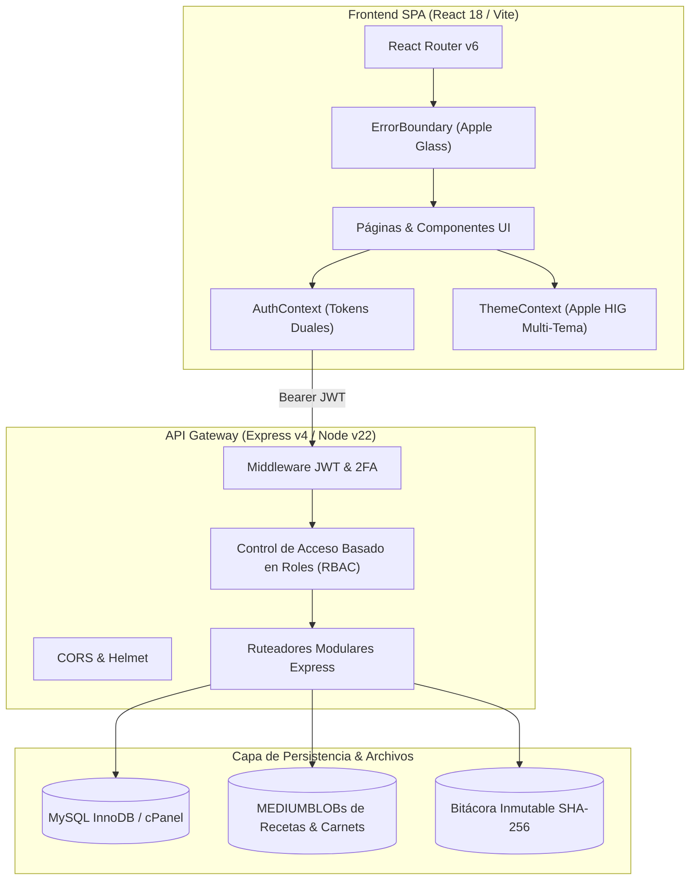
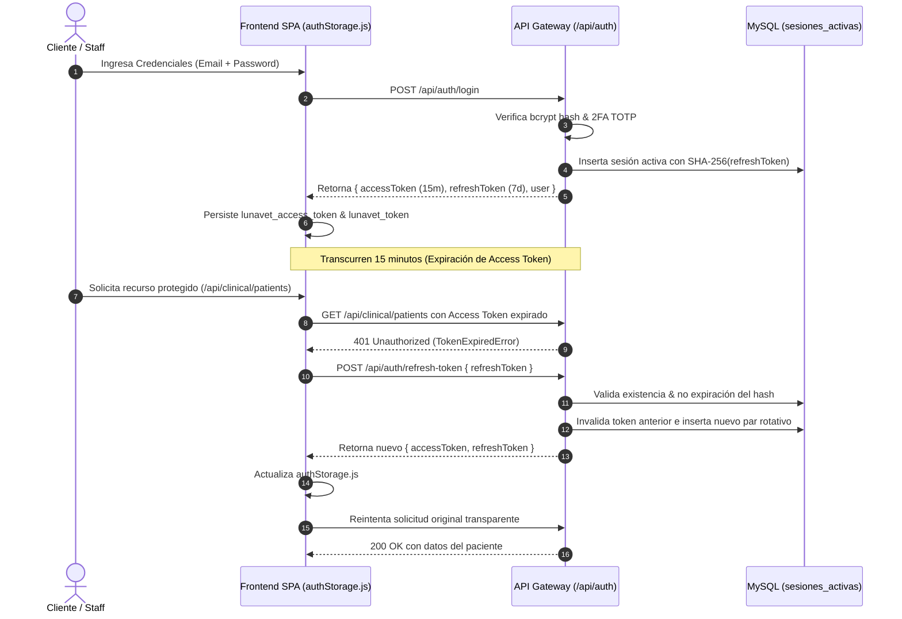
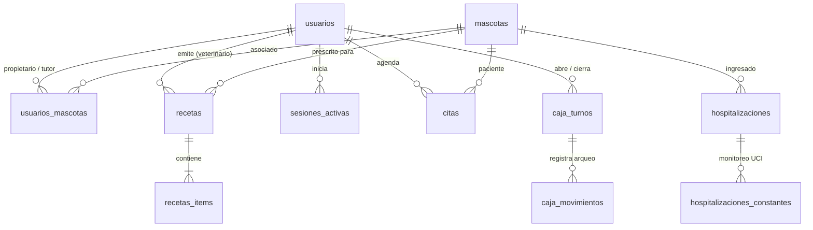

# Luna-Vet Acapulco — Manual Técnico de Arquitectura e Ingeniería (Estándar Diátaxis)
> Documentación técnica formal estructurada en los 4 cuadrantes Diátaxis: Tutoriales, Guías Prácticas (How-To), Referencia de APIs y Explicaciones de Arquitectura.

---

```
                              ORIENTADO AL APRENDIZAJE
                                         ▲
                                         │
                    1. TUTORIALES        │      2. GUÍAS HOW-TO
               (Primeros pasos guiados)  │   (Tareas prácticas paso a paso)
                                         │
    PRÁCTICO ◄───────────────────────────┼───────────────────────────► TEÓRICO
                                         │
                    4. EXPLICACIÓN       │       3. REFERENCIA
              (Arquitectura y decisiones)│    (APIs, esquemas y tipos)
                                         │
                                         ▼
                               ORIENTADO AL TRABAJO
```

---

## 🧭 Cuadrante 1: Tutoriales (Aprendizaje)

### Tutorial 1.1: Despliegue Local del Entorno de Desarrollo (Zero to Localhost)
> [!NOTE]
> Este tutorial guía a un nuevo ingeniero desde la clonación del repositorio hasta la primera prueba unitaria en verde en menos de 10 minutos.

1. **Clonación del Repositorio e Instalación del Backend**:
   ```powershell
   git clone https://github.com/jede1996/lunavet.git vet
   cd vet/backend
   npm install
   cp .env.example .env
   ```
2. **Instalación y Configuración del Frontend**:
   ```powershell
   cd ../frontend
   npm install
   ```
3. **Ejecución y Verificación de la Suite**:
   ```powershell
   # En terminal backend:
   npm test

   # En terminal frontend:
   npm test -- --run
   npx oxlint src
   ```
4. **Inicio de Servidores en Desarrollo**:
   ```powershell
   # Terminal 1 (Backend API en http://localhost:3000):
   cd backend && npm run dev

   # Terminal 2 (Frontend SPA en http://localhost:5173):
   cd frontend && npm run dev
   ```

### Tutorial 1.2: Creación de un Componente Clínico con Estándares Apple HIG
> [!TIP]
> Todo componente en Luna-Vet debe integrarse con el sistema multi-tema sin hardcodear colores ni desencadenar llamadas síncronas a `setState` en efectos.

1. **Estructura del Componente**:
   Crea el archivo en `frontend/src/components/clinical/NombreComponente.jsx`.
2. **Consumo de Variables Semánticas**:
   ```jsx
   import React, { useState, useEffect } from 'react';
   import { useTheme } from '../../contexts/ThemeContext';

   export function PatientStatusCard({ patientId }) {
     const { isDark } = useTheme();
     const [data, setData] = useState(null);
     const [loading, setLoading] = useState(true);

     useEffect(() => {
       let active = true;
       const loadPatient = async () => {
         try {
           const token = localStorage.getItem('lunavet_access_token') || localStorage.getItem('lunavet_token');
           const res = await fetch(`/api/clinical/patients/${patientId}`, {
             headers: { Authorization: `Bearer ${token}` }
           });
           const json = await res.json();
           if (active && res.ok) setData(json.data);
         } finally {
           if (active) setLoading(false);
         }
       };
       loadPatient();
       return () => { active = false; };
     }, [patientId]);

     if (loading) return <div className="spinner-border text-primary" role="status" />;

     return (
       <div
         className="card border-0 shadow-sm p-4"
         style={{
           borderRadius: '20px',
           backdropFilter: 'blur(20px)',
           background: 'var(--apple-card-bg)',
           border: '1px solid var(--apple-border)'
         }}
       >
         <h5 className="fw-bold mb-1" style={{ color: 'var(--apple-text-primary)' }}>
           {data?.nombre}
         </h5>
         <span className="badge rounded-pill bg-success-subtle text-success">
           Estable
         </span>
       </div>
     );
   }
   ```
3. **Verificación Visual**:
   Comprueba el renderizado en modo **Apple Claro**, **Apple Oscuro** y **Alto Contraste**.

---

## 🛠️ Cuadrante 2: Guías How-To (Tareas Prácticas)

### How-To 2.1: Cómo Ejecutar el Ciclo TDD ante un Nuevo Endpoint
1. Abre `backend/tests/integration/` y crea el archivo de prueba (ej. `modulo.test.js`).
2. Escribe la prueba fallida esperando un código de respuesta HTTP determinista (`Fase Red`):
   ```javascript
   it('debe registrar el procedimiento clínico y retornar 201', async () => {
     const res = await request(app)
       .post('/api/clinical/procedures')
       .set('Authorization', `Bearer ${vetToken}`)
       .send({ pacienteId: 1, tipo: 'limpieza_dental' });
     expect(res.status).toBe(201);
     expect(res.body.success).toBe(true);
   });
   ```
3. Ejecuta `npm test -- tests/integration/modulo.test.js` y confirma el fallo (`404 Not Found`).
4. Añade la ruta en `backend/src/modules/clinical/` y su controlador mínimo (`Fase Green`).
5. Re-ejecuta la prueba hasta obtener `201 Created`.
6. Refactoriza validando entradas y extrayendo lógica (`Fase Refactor`).

### How-To 2.2: Cómo Desplegar en Producción (cPanel + Phusion Passenger)
1. **Compilar el Frontend**:
   ```powershell
   cd frontend
   npm run build
   ```
2. **Subir los Archivos Estáticos**:
   Copia el contenido de `frontend/dist/` a la carpeta raíz pública de cPanel (`public_html/`).
3. **Configurar el Backend en cPanel**:
   - Accede a **Setup Node.js App** en cPanel.
   - Versión de Node.js: `20.x` o `22.x`.
   - Application Mode: `Production`.
   - Application Root: `api_backend`.
   - Application Startup File: `src/server.js`.
4. **Configurar Variables de Entorno en cPanel**:
   Define `DB_HOST`, `DB_USER`, `DB_PASSWORD`, `DB_NAME`, `JWT_SECRET`, `APP_KEY_HEX` y `CRON_SECRET`.
5. **Reiniciar la Aplicación Passenger**:
   Haz clic en **Restart Application** en cPanel.

### How-To 2.3: Cómo Realizar una Auditoría de Medicamentos Controlados SENASICA
1. Inicia sesión como administrador o veterinario en `/login`.
2. Dirígete a `/staff/controlados`.
3. Consulta el balance de entradas y salidas por lote y sustancia activa (Ketamina, Tramadol, Diazepam).
4. Para exportar la bitácora legal:
   ```powershell
   curl -H "Authorization: Bearer <TOKEN>" https://api.lunavet.lat/api/clinical/controlled-meds/audit-report
   ```
5. Verifica que cada movimiento cuente con número de cédula profesional y hash de firma digital.

### How-To 2.4: Cómo Realizar el Arqueo y Corte Z de Caja Chica
1. Accede al punto de venta en `/staff/pos`.
2. Haz clic en **Control de Caja Chica** en la barra superior.
3. Ingresa el conteo físico de efectivo en **Monto Real al Cierre**.
4. Haz clic en **Confirmar y Cerrar Turno (Corte Z)**.
5. El sistema calcula la discrepancia, registra la transacción atómica y emite el comprobante imprimible.

---

## 📚 Cuadrante 3: Referencia Técnica (Especificación de APIs & Modelos)

### 3.1 Contrato Global de Respuesta HTTP (Envelope REST)

#### Respuesta Exitosa (`200 OK`, `201 Created`):
```json
{
  "status": "success",
  "success": true,
  "data": { ... },
  "message": "Operación completada exitosamente",
  "meta": {
    "page": 1,
    "limit": 20,
    "total": 100
  }
}
```

#### Respuesta de Error (`400`, `401`, `403`, `404`, `409`, `422`, `500`):
```json
{
  "status": "error",
  "success": false,
  "error": {
    "code": "VALIDATION_ERROR",
    "message": "Descripción comprensible para el usuario",
    "details": null
  }
}
```

### 3.2 Catálogo de Endpoints REST de la Plataforma

| Módulo | Método | Endpoint | Roles Permitidos | Payload de Entrada | Respuesta Clave |
| :--- | :---: | :--- | :--- | :--- | :--- |
| **Auth** | `POST` | `/api/auth/login` | Público | `{ email, password }` | `{ accessToken, refreshToken, user }` |
| **Auth** | `POST` | `/api/auth/staff/login` | Personal Clínico | `{ email, password }` | `{ accessToken, refreshToken, user }` |
| **Auth** | `POST` | `/api/auth/refresh-token` | Autenticado | `{ refreshToken }` | `{ accessToken, refreshToken }` |
| **Auth** | `POST` | `/api/auth/2fa/verify-login` | Público (Con tempToken) | `{ tempToken, token2fa }` | `{ accessToken, user }` |
| **Mascotas** | `GET` | `/api/pets` | Cliente / Staff / Admin | N/A | `[ { id, nombre, especie, raza } ]` |
| **Mascotas** | `POST` | `/api/pets` | Cliente / Staff / Admin | `{ nombre, especie, raza, sexo }` | `{ id, folio, microchip }` |
| **Citas** | `GET` | `/api/appointments` | Cliente / Staff / Admin | Query `fecha`, `estado` | `[ { id, fecha, motivo, paciente } ]` |
| **Citas** | `POST` | `/api/appointments` | Cliente / Staff / Admin | `{ mascota_id, fecha, servicio_id }` | `{ id, folio, estado: 'agendada' }` |
| **Caja** | `GET` | `/api/commerce/cash-register/active` | Recepción / Admin | N/A | Datos del turno o `null` |
| **Caja** | `POST` | `/api/commerce/cash-register/open` | Recepción / Admin | `{ monto_inicial, notas }` | `{ id, estado: 'abierto' }` |
| **Caja** | `POST` | `/api/commerce/cash-register/:id/cut-z`| Recepción / Admin | `{ monto_cierre_real, notas }` | `{ diferencia, total_calculado }` |
| **Hospital** | `GET` | `/api/clinical/hospitalizations` | Veterinario / Admin | Query `estado` | Listado de jaulas y constantes UCI |
| **Hospital** | `POST` | `/api/clinical/hospitalizations/:id/monitoring`| Veterinario | `{ temperatura, fc, fr, pa, dolor }` | `{ id, registrado_en }` |
| **Estética** | `POST` | `/api/clinical/grooming/checkins` | Recepción / Estilista | `{ mascota_id, manto, corte, lesiones }`| `{ id, folio }` |
| **Recetas** | `GET` | `/api/clinical/prescriptions/:folio` | Público | N/A | `{ folio, medico, paciente, items }` |
| **Recetas** | `GET` | `/api/clinical/prescriptions/:folio/pdf`| Público / Auth | N/A | Stream `application/pdf` |

### 3.3 Diccionario de Datos Relacional (MySQL InnoDB)

#### Tabla `usuarios`
- `id` (INT, PK, AUTO_INCREMENT)
- `email` (VARCHAR(191), UNIQUE, INDEX)
- `password_hash` (VARCHAR(255), NOT NULL, bcrypt cost 12)
- `nombre` (VARCHAR(100)), `apellido` (VARCHAR(100))
- `rol` (ENUM: `'cliente'`, `'veterinario'`, `'recepcionista'`, `'administrador'`, INDEX)
- `cedula_profesional` (VARCHAR(50), NULL)
- `dos_factores_habilitado` (BOOLEAN, DEFAULT FALSE)
- `dos_factores_secreto` (VARCHAR(255), NULL, Cifrado AES-256-GCM)

#### Tabla `recetas`
- `id` (INT, PK, AUTO_INCREMENT)
- `folio` (VARCHAR(50), UNIQUE, INDEX)
- `veterinario_id` (INT, FK -> `usuarios.id`, RESTRICT)
- `mascota_id` (INT, FK -> `mascotas.id`, RESTRICT)
- `fecha_emision` (DATE, NOT NULL)
- `vigencia_dias` (INT, NOT NULL, DEFAULT 30)
- `firma_digital_hash` (VARCHAR(64), NOT NULL, SHA-256)
- `estado` (ENUM: `'activa'`, `'surtida'`, `'cancelada'`, `'vencida'`, INDEX)

#### Tabla `blobs`
- `id` (INT, PK, AUTO_INCREMENT)
- `uuid` (VARCHAR(36), UNIQUE, INDEX)
- `nombre_archivo` (VARCHAR(255), NOT NULL, Sanitizado)
- `mime_type` (VARCHAR(100), NOT NULL, Validado por Magic Bytes)
- `tamano_bytes` (INT, NOT NULL)
- `sha256_hash` (VARCHAR(64), NOT NULL)
- `buffer` (MEDIUMBLOB, NOT NULL, Hasta 16MB)

### 3.4 Variables de Entorno

| Variable | Tipo | Entorno | Descripción |
| :--- | :--- | :--- | :--- |
| `NODE_ENV` | String | Back | `'development'` o `'production'` |
| `PORT` | Number | Back | Puerto de escucha (Default: `3000`) |
| `DB_HOST` | String | Back | Servidor MySQL (`localhost` o IP) |
| `DB_NAME` | String | Back | Nombre de base de datos (`lunavet_db`) |
| `JWT_SECRET` | String (Hex 64) | Back | Clave de firma para Access Tokens |
| `JWT_REFRESH_SECRET` | String (Hex 64) | Back | Clave de firma para Refresh Tokens |
| `APP_KEY_HEX` | String (Hex 64) | Back | Llave simétrica AES-256-GCM para datos en reposo |
| `VITE_API_URL` | String (URL) | Front | Endpoint base de la API REST (`https://api.lunavet.lat/api`) |

---

## 🏛️ Cuadrante 4: Explicación de Arquitectura (Decisiones & Tradeoffs)

### 4.1 Diagrama de Arquitectura de Alto Nivel (Mermaid)



### 4.2 Diagrama de Secuencia de Autenticación & Rotación de Tokens



### 4.3 Diagrama Entidad-Relación de Persistencia (Mermaid)



### 4.4 Registro de Decisiones de Arquitectura (ADRs)

1. **ADR-001: Almacenamiento Desacoplado de Archivos en MySQL BLOB**:
   - *Contexto*: El hosting en cPanel compartido restringe buckets S3 externos por latencia y costos.
   - *Decisión*: Almacenar PDFs y placas en tabla `blobs` mediante `MEDIUMBLOB` con validación estricta de magic-bytes y streaming HTTP.
   - *Consecuencia*: Respaldos atómicos integrados en el volcado SQL diario (`mysqldump`) sin riesgo de orfandad de archivos.

2. **ADR-002: Dualidad de Tokens de Sesión (`lunavet_access_token` + `lunavet_token`)**:
   - *Contexto*: Coexistencia de llamadas al cliente unificado `api.client.js` y llamadas `fetch` heredadas.
   - *Decisión*: Implementar el adaptador centralizado `authStorage.js` que mantiene sincronizadas ambas claves en `localStorage`.
   - *Consecuencia*: Cero errores 401 en recargas directas F5 en módulos clínicos.

3. **ADR-003: Adopción de Apple Human Interface Guidelines (HIG)**:
   - *Contexto*: Necesidad de una interfaz distintiva, clínica y no genérica.
   - *Decisión*: Modularizar el CSS por temas (`themes/apple/`, `themes/classic/`, `themes/high-contrast/`) con Apple Claro como tema base.
   - *Consecuencia*: Jerarquía visual óptima, desenfoque Liquid Glass y 0 dependencias pesadas de runtime CSS.

4. **ADR-004: Generador de PDFs Nativo en Memoria sin Chromium**:
   - *Contexto*: cPanel compartido no permite lanzar procesos Puppeteer/Chrome headless por restricciones de memoria RAM.
   - *Decisión*: Utilizar PDFKit en JavaScript puro para generar recetas, credenciales y comprobantes en streaming binario sub-20ms.
   - *Consecuencia*: Compatibilidad 100% con cPanel Passenger, consumo de RAM mínimo (< 35MB).

5. **ADR-005: Error Boundary con Estética Apple Glass**:
   - *Contexto*: Evitar pantallas blancas imprevistas ante excepciones en tiempo de ejecución.
   - *Decisión*: Implementar [ErrorBoundary.jsx](file:///frontend/src/components/common/ErrorBoundary.jsx) envolviendo el árbol de rutas con botones de autorrecuperación y diagnóstico seguro en desarrollo.
   - *Consecuencia*: Experiencia de usuario ininterrumpida y resiliencia ante contingencias de red.
