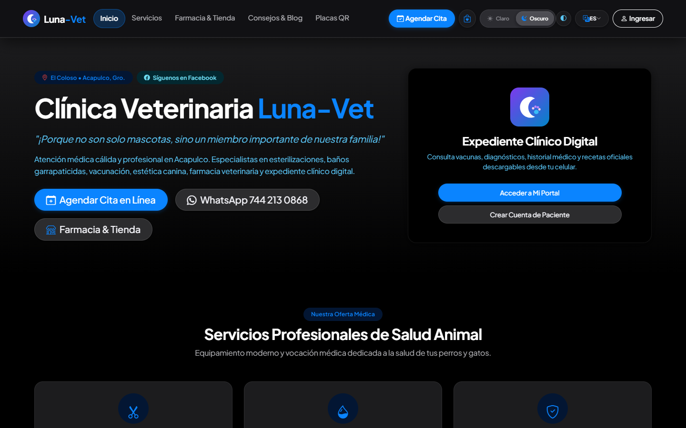
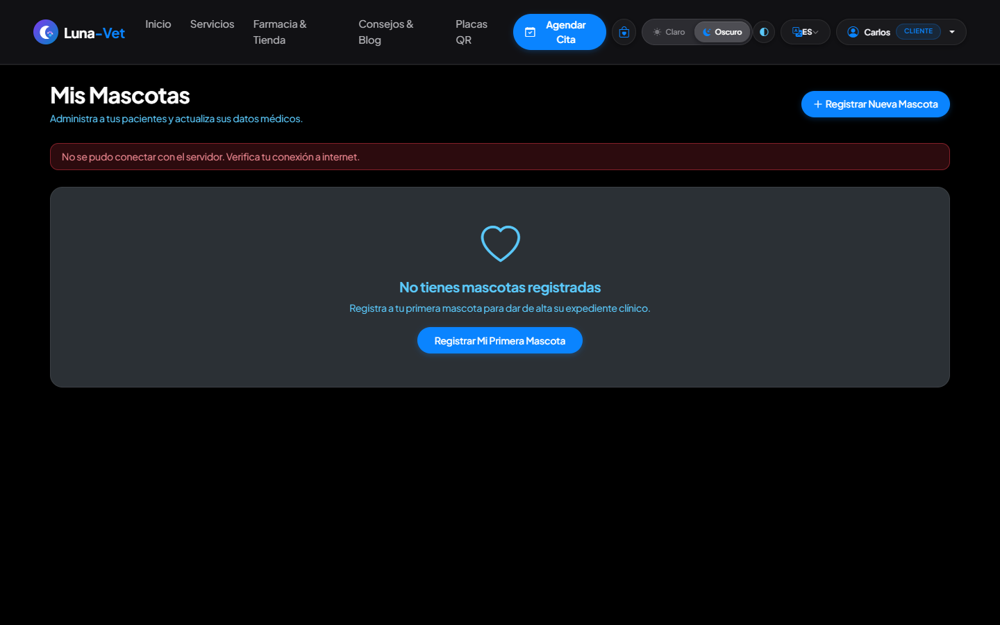
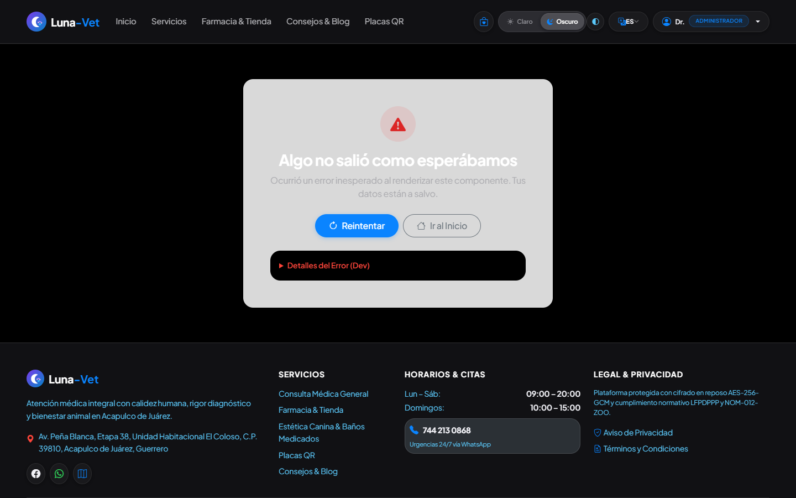

# Manual del Usuario — Clínica Veterinaria Luna-Vet
### Sistema Digital Integral de Salud Animal, Farmacia & Estética | Acapulco de Juárez, Guerrero

**Versión del manual:** 4.5  
**Fecha de actualización:** Octubre 2026  
**Diseño de interfaz:** Apple Segmented Glassmorphic (HIG)  
**Clasificación:** Guía oficial y operativa para Tutores, Personal Clínico y Dirección  
**Ubicación de la Clínica:** Av. Peña Blanca, Etapa 38, Unidad Habitacional El Coloso, C.P. 39810, Acapulco de Juárez, Gro.  
**Atención de Urgencias Médicas:** WhatsApp / Teléfono: 744 213 0868  

---

> *"Porque no son solo mascotas, sino un miembro importante de nuestra familia."*  
> Este manual te acompaña de forma clara, amigable y detallada para que aproveches cada herramienta de Luna-Vet: desde cómo tramitar una placa QR gratuita para tu cachorro y agendar una consulta médica desde tu teléfono móvil, hasta el control de medicamentos en quirófano, el monitoreo en hospitalización intensiva y el cobro de servicios en recepción.

---

## Índice General de Contenidos

1. [¿Cómo usar este manual?](#1-cómo-usar-este-manual)
2. [Experiencia Visual Apple Segmented Glassmorphic](#2-experiencia-visual-apple-segmented-glassmorphic)
   - 2.1 [Selector Segmentado en la Barra de Navegación](#21-selector-segmentado-en-la-barra-de-navegación)
   - 2.2 [Apple Claro (Liquid Glass) vs. Apple Oscuro (OLED Glassmorphic)](#22-apple-claro-liquid-glass-vs-apple-oscuro-oled-glassmorphic)
   - 2.3 [Modo Quirófano (Alto Contraste Clínico WCAG AA)](#23-modo-quirófano-alto-contraste-clínico-wcag-aa)
   - 2.4 [Selector de Idioma (Español / English)](#24-selector-de-idioma-español--english)
3. [Módulo 1: Servicios Públicos y Abiertos (Sin Necesidad de Cuenta)](#3-módulo-1-servicios-públicos-y-abiertos-sin-necesidad-de-cuenta)
   - 3.1 [Página Principal y Especialidades Clínicas](#31-página-principal-y-especialidades-clínicas)
   - 3.2 [Catálogo de Servicios Médicos y Quirúrgicos](#32-catálogo-de-servicios-médicos-y-quirúrgicos)
   - 3.3 [Farmacia Veterinaria y Tienda de Alimentos (Click & Collect)](#33-farmacia-veterinaria-y-tienda-de-alimentos-click--collect)
   - 3.4 [Agendamiento de Citas Médicas y Estéticas en Línea](#34-agendamiento-de-citas-médicas-y-estéticas-en-línea)
   - 3.5 [Generador Gratuito de Placas QR Inteligentes para Mascotas](#35-generador-gratuito-de-placas-qr-inteligentes-para-mascotas)
   - 3.6 [Verificador Oficial de Recetas Médicas](#36-verificador-oficial-de-recetas-médicas)
4. [Módulo 2: Registro, Inicio de Sesión y Seguridad de tu Cuenta](#4-módulo-2-registro-inicio-de-sesión-y-seguridad-de-tu-cuenta)
   - 4.1 [Cómo iniciar sesión en la plataforma](#41-cómo-iniciar-sesión-en-la-plataforma)
   - 4.2 [Cómo crear una nueva cuenta de tutor](#42-cómo-crear-una-nueva-cuenta-de-tutor)
   - 4.3 [Protección de cuentas y verificación en dos pasos (2FA)](#43-protección-de-cuentas-y-verificación-en-dos-pasos-2fa)
   - 4.4 [Recuperación de contraseñas y salida segura](#44-recuperación-de-contraseñas-y-salida-segura)
5. [Módulo 3: Portal del Tutor (Expediente Digital de tu Mascota)](#5-módulo-3-portal-del-tutor-expediente-digital-de-tu-mascota)
   - 5.1 [Tu panel de bienvenida](#51-tu-panel-de-bienvenida)
   - 5.2 [Cómo dar de alta a tus perros y gatos](#52-cómo-dar-de-alta-a-tus-perros-y-gatos)
   - 5.3 [Carnet de vacunación, desparasitaciones e historial clínico](#53-carnet-de-vacunación-desparasitaciones-e-historial-clínico)
   - 5.4 [Seguimiento y administración de tus citas](#54-seguimiento-y-administración-de-tus-citas)
   - 5.5 [Compras con recolección directa en la clínica](#55-compras-con-recolección-directa-en-la-clínica)
6. [Módulo 4: Portal Clínico y Operativo (Veterinarios, Estética y Recepción)](#6-módulo-4-portal-clínico-y-operativo-veterinarios-estética-y-recepción)
   - 6.1 [Agenda Médica y Control de Turnos](#61-agenda-médica-y-control-de-turnos)
   - 6.2 [Consulta Médica, Constantes Vitales y Receta Digital](#62-consulta-médica-constantes-vitales-y-receta-digital)
   - 6.3 [Hospitalización, Triage y Cuidados Intensivos (UCI)](#63-hospitalización-triage-y-cuidados-intensivos-uci)
   - 6.4 [Punto de Venta Mostrador (POS) y Arqueo de Caja Chica](#64-punto-de-venta-mostrador-pos-y-arqueo-de-caja-chica)
   - 6.5 [Libro de Fármacos Controlados y Trazabilidad SENASICA](#65-libro-de-fármacos-controlados-y-trazabilidad-senasica)
7. [Módulo 5: Panel de Dirección y Administración General](#7-módulo-5-panel-de-dirección-y-administración-general)
   - 7.1 [Tablero de Indicadores Clave (KPIs en Tiempo Real)](#71-tablero-de-indicadores-clave-kpis-en-tiempo-real)
   - 7.2 [Inventario Inteligente con Semáforo FEFO y Lotes](#72-inventario-inteligente-con-semáforo-fefo-y-lotes)
   - 7.3 [Gestor de Contenido y Marca de la Clínica (CMS)](#73-gestor-de-contenido-y-marca-de-la-clínica-cms)
   - 7.4 [Administración del Equipo Médico y Cédulas Profesionales](#74-administración-del-equipo-médico-y-cédulas-profesionales)
8. [Preguntas Frecuentes y Guía de Ayuda Rápida](#8-preguntas-frecuentes-y-guía-de-ayuda-rápida)
9. [Directorio de Contacto y Asistencia Clínica](#9-directorio-de-contacto-y-asistencia-clínica)

---

## 1. ¿Cómo usar este manual?

Para facilitar tu navegación, este manual está estructurado por objetivos prácticos y por tu rol en la clínica:

| Si eres... | ¿Qué secciones debes consultar? | ¿Qué puedes hacer en Luna-Vet? |
| :--- | :--- | :--- |
| **Tutor de Mascota (Cliente)** | Módulos 1, 2, 3 y 8 | Ver vacunas, agendar citas, descargar recetas, comprar alimentos y generar placas QR. |
| **Personal de Recepción** | Módulos 1, 4 (6.1, 6.4) y 8 | Atender a tutores en mostrador, agendar turnos, cobrar en caja y hacer cortes diarios. |
| **Médico Veterinario (MVZ)** | Módulo 4 completo (6.1, 6.2, 6.3, 6.5) | Realizar consultas médicas, recetar con firma digital, monitorear hospitalizados y registrar fármacos. |
| **Estilista Canino / Groomer** | Módulo 4 (6.1 y 6.4) | Recibir mascotas en baño/corte, registrar estado del manto y notificar la entrega al tutor. |
| **Administrador General** | Módulo 5 completo | Supervisar ventas, compras, caducidades de medicamentos, personal y marca de la clínica. |

### Convenciones Visuales y Avisos

A lo largo de este manual encontrarás recuadros diseñados para resaltar información clave:

> [!NOTE]
> **Nota de Contexto:** Aclaraciones sobre el comportamiento habitual del sistema o consejos de navegación.

> [!TIP]
> **Consejo Práctico:** Atajos y sugerencias operativas para ahorrar tiempo en tu día a día.

> [!IMPORTANT]
> **Paso Indispensable:** Requisitos obligatorios que no debes omitir (como el peso exacto del paciente o la cédula médica).

> [!WARNING]
> **Punto de Precaución:** Cuidados especiales para evitar errores en cobros, horarios o registros de pacientes.

> [!CAUTION]
> **Acción Delicada:** Operaciones con impacto legal, financiero o médico grave, como la descarga de medicamentos controlados ante SENASICA.

---

## 2. Experiencia Visual Apple Segmented Glassmorphic

Luna-Vet incorpora un sistema visual de vanguardia fundamentado en las directrices oficiales **Apple Human Interface Guidelines (HIG)** con materiales **Liquid Glass**. Esta estética proporciona superficies translúcidas de cristal esmerilado, bordes suaves y máxima nitidez visual tanto en pantallas médicas de consultorio como en teléfonos móviles bajo el sol tropical de Acapulco.

### 2.1 Selector Segmentado en la Barra de Navegación

En la parte superior derecha de la barra de navegación, disponible de manera constante en cualquier página, se encuentra el **Selector Segmentado Apple (Segmented Control)**:

```
┌─────────────────────────────────┐   ┌───┐
│  ☀️ Claro   │   🌙 Oscuro       │   │ 👁️ │
└─────────────────────────────────┘   └───┘
  (Control Segmentado Glassmorphic)   (Quirófano)
```

- **Píldora deslizante táctil:** Al pulsar sobre *Claro* u *Oscuro*, la cápsula se desplaza suavemente con una animación de resorte háptico.
- **Persistencia inteligente:** Tu elección se almacena en tu dispositivo, manteniendo tu modo preferido siempre que regreses.
- **Respuesta táctil y accesible:** En pantallas grandes muestra texto e icono; en teléfonos móviles se compacta de forma ordenada para no saturar la barra de herramientas.

### 2.2 Apple Claro (Liquid Glass) vs. Apple Oscuro (OLED Glassmorphic)

Puedes alternar libremente entre los dos acabados oficiales de la plataforma:

#### Opción 1: Apple Claro (Liquid Glass)
Superficies translúcidas de cristal blanco con desenfoque de fondo (`backdrop-filter: blur(24px)`), reflejos de luz sutiles y tarjetas agrupadas. Es la opción ideal para oficinas, recepción y consultas diurnas.


*Vista de Luna-Vet en modo Apple Claro: superficies luminosas de alta definición y control segmentado integrado.*

#### Opción 2: Apple Oscuro (OLED Glassmorphic)
Fondos en negro profundo absoluto (`#000000`) combinados con paneles translúcidos en grafito oscuro y acentos de color vibrantes. Diseñado para guardias médicas nocturnas, salas de ecografía y para disminuir el cansancio visual.


*Vista de Luna-Vet en modo Apple Oscuro: elegancia OLED para jornadas nocturnas con acentos nítidos.*

### 2.3 Modo Quirófano (Alto Contraste Clínico WCAG AA)

Junto al selector de tema encontrarás el botón circular con el icono de contraste (`bi-circle-half`). Al presionarlo, se activa el **Modo Quirófano**:
- Los textos aumentan su intensidad a negro puro o blanco puro sin transparencias intermedias.
- Las tarjetas y tablas incorporan bordes marcados de alto contraste.
- Está certificado bajo el estándar de accesibilidad internacional **WCAG AA**, pensado para cirujanos en quirófano o personal trabajando a distancia frente a monitores clínicos.

### 2.4 Selector de Idioma (Español / English)

Al lado del selector visual se ubica el botón de idioma con la bandera y código de país:
- **Español (🇲🇽):** Idioma oficial por defecto con terminología médica de México.
- **English (🇺🇸):** Traduce menús, botones, estados clínicos y avisos para visitantes extranjeros y residentes internacionales en Acapulco.

---

## 3. Módulo 1: Servicios Públicos y Abiertos (Sin Necesidad de Cuenta)

Cualquier persona puede ingresar a Luna-Vet sin necesidad de registrarse ni iniciar sesión para conocer los servicios clínicos, comprar productos, agendar una cita o tramitar placas de identificación animal.

### 3.1 Página Principal y Especialidades Clínicas

La portada de bienvenida presenta la identidad médica de Luna-Vet, horarios de atención de urgencias 24/7 y acceso rápido a los servicios primarios:


*Pantalla de bienvenida con hero interactivo, catálogo de servicios y barra superior con el control segmentado.*

- **Acceso directo a Citas:** Botón azul prominente *"Agendar Cita"* para reservar atención médica en segundos.
- **Botón de Urgencias:** Enlace directo de WhatsApp conectado las 24 horas con el personal de guardia en El Coloso.
- **Indicadores de Confianza:** Resumen de pacientes atendidos, cirugías exitosas y años de experiencia en Acapulco.

### 3.2 Catálogo de Servicios Médicos y Quirúrgicos

Al pulsar en *"Servicios"* en la barra superior, se despliega el menú exhaustivo de especialidades:


*Catálogo clínico con tarjetas informativas sobre medicina preventiva, quirófano, imagenología y hospitalización.*

1. **Medicina General y Vacunación:** Cuadros biológicos para cachorros y adultos, desparasitación interna y externa.
2. **Cirugía de Tejidos Blandos y Esterilización:** Quirófano con monitoreo multiparamétrico y anestesia inhalatoria.
3. **Laboratorio Clínico In-House:** Hemogramas, químicas sanguíneas y pruebas rápidas virales en menos de 30 minutos.
4. **Hospitalización y Cuidados Intensivos (UCI):** Jaulas climatizadas con bombas de infusión y vigilancia constante.
5. **Estética y Grooming Médico:** Baños medicados, cortes de raza y limpieza dental ultrasónica.

### 3.3 Farmacia Veterinaria y Tienda de Alimentos (Click & Collect)

En la sección *"Farmacia & Tienda"* los tutores pueden explorar alimentos de prescripción, fármacos de venta libre y accesorios:


*Catálogo de farmacia con filtros por categoría (Alimentos, Medicamentos, Higiene) y botón de compra rápida.*

#### Cómo realizar un pedido con recolección en clínica:
1. Navega por las categorías o utiliza el buscador para localizar el producto (por ejemplo, *Royal Canin Gastrointestinal* o *NexGard Spectra*).
2. Selecciona la presentación o peso requerido y pulsa **"Agregar al Carrito"**.
3. En la barra superior, pulsa el icono de la bolsa de compras (`bi-bag-heart`) para revisar tus productos seleccionados.
4. Pulsa **"Completar Pedido"** para recibir tu folio de recolección y pasar por tus artículos al mostrador de la clínica sin filas.

> [!TIP]
> Los medicamentos antibióticos o controlados requieren mostrar la receta física o digital al momento de retirar tu pedido en la farmacia de la clínica.

### 3.4 Agendamiento de Citas Médicas y Estéticas en Línea

El módulo de agendamiento permite reservar una fecha y hora sin llamadas telefónicas previas:


*Formulario interactivo para seleccionar motivo de consulta, especie de mascota, fecha y horario disponible.*

#### Procedimiento paso a paso para agendar:
1. **Datos del Tutor:** Ingresa tu nombre completo, teléfono celular (WhatsApp) y correo electrónico.
2. **Datos del Paciente:** Indica el nombre de tu mascota, especie (*Perro*, *Gato*, *Otro*), raza y edad aproximada.
3. **Motivo de la Cita:** Selecciona entre *Consulta Médica General*, *Vacunación / Desparasitación*, *Cirugía Programada* o *Estética & Baño*.
4. **Fecha y Horario:** Elige el día en el calendario; el sistema desplegará únicamente los horarios con disponibilidad real.
5. **Confirmación:** Pulsa **"Confirmar mi Cita"**. Recibirás un folio de reservación y una notificación inmediata en tu WhatsApp.

### 3.5 Generador Gratuito de Placas QR Inteligentes para Mascotas

Luna-Vet ofrece una herramienta cívica y gratuita para la comunidad de Acapulco: el generador de placas de identificación con código QR:


*Herramienta para diseñar y descargar placas QR personalizadas con datos de emergencia y contacto del tutor.*

#### Cómo crear y descargar la placa QR de tu mascota:
1. Ingresa a la sección *"Placas QR"* en el menú superior.
2. Completa el formulario de identificación:
   - Nombre de la mascota y especie.
   - Nombre del propietario o tutor responsable.
   - Teléfono de emergencia y contacto secundario.
   - Observaciones médicas importantes (por ejemplo, *"Es diabético"*, *"Alérgico al pollo"*, *"Toma medicamento diario"*).
3. Personaliza la placa eligiendo el color temático y marco protector.
4. El sistema generará el código QR vectorial en tiempo real.
5. Pulsa **"Descargar Placa (PNG / PDF)"** para imprimirla, enmicarla o grabarla en el collar de tu animal de compañía.

> [!NOTE]
> Cuando una persona escanee el código QR con cualquier celular, podrá ver inmediatamente tu teléfono para llamarte o enviarte un WhatsApp en caso de extravío.

### 3.6 Verificador Oficial de Recetas Médicas

Cualquier farmacia, autoridad o tutor puede comprobar la validez de una prescripción médica emitida por la clínica ingresando su folio único:


*Pantalla pública de validación con sello de seguridad, datos del médico veterinario firmante y medicamentos prescritos.*

- Muestra la cédula profesional del médico firmante.
- Detalla la dosis, frecuencia y duración del tratamiento prescrito.
- Certifica que la receta no ha sido alterada ni reutilizada de forma ilícita.

---

## 4. Módulo 2: Registro, Inicio de Sesión y Seguridad de tu Cuenta

Crear una cuenta en Luna-Vet te da acceso al historial clínico permanente de tus mascotas, recordatorios de citas y compras centralizadas.

### 4.1 Cómo iniciar sesión en la plataforma

Para ingresar a tu cuenta existente:
1. En la esquina superior derecha, pulsa el botón **"Ingresar"**.
2. Escribe tu correo electrónico y tu contraseña registrada.
3. Pulsa **"Iniciar Sesión"**.


*Formulario de acceso seguro con campos protegidos, enlace de recuperación y opción de ingreso con biometría.*

> [!TIP]
> Si utilizas una computadora personal o tu propio teléfono móvil, puedes marcar la opción *"Mantener sesión activa"* para no tener que escribir tu contraseña en cada visita.

### 4.2 Cómo crear una nueva cuenta de tutor

Si visitas la clínica por primera vez:
1. En la pantalla de ingreso, haz clic en la pestaña **"Crear Cuenta"** o pulsa el enlace *"¿No tienes cuenta? Regístrate aquí"*.
2. Llena los campos requeridos:
   - Nombre y Apellidos completos.
   - Teléfono de contacto (10 dígitos).
   - Correo electrónico válido.
   - Contraseña segura (mínimo 8 caracteres, combinando letras y números).
3. Acepta los Términos de Servicio y el Aviso de Privacidad.
4. Pulsa **"Crear mi Cuenta"**.


*Formulario de creación de cuenta con validación instantánea de fortaleza de contraseña.*

### 4.3 Protección de cuentas y verificación en dos pasos (2FA)

Para el personal médico y administrativo, y de forma opcional para tutores, la plataforma cuenta con autenticación en dos factores (2FA):
- Al iniciar sesión desde un dispositivo nuevo, se solicitará un código de 6 dígitos enviado por SMS/WhatsApp o generado por tu aplicación autenticadora (Google Authenticator / Apple Passwords).
- Esto impide que personas ajenas puedan ingresar a tus datos clínicos aunque conozcan tu contraseña.

### 4.4 Recuperación de contraseñas y salida segura

- **Olvidé mi contraseña:** En la pantalla de login, pulsa *"¿Olvidaste tu contraseña?"*, ingresa tu correo y recibirás un enlace de restablecimiento seguro válido por 15 minutos.
- **Cierre de sesión:** Para salir de tu cuenta, haz clic en tu nombre en la barra superior y selecciona la opción roja **"Cerrar Sesión"**. Se recomienda realizarlo siempre que uses computadoras compartidas en recepción o cibercafés.

---

## 5. Módulo 3: Portal del Tutor (Expediente Digital de tu Mascota)

El Portal del Tutor es tu espacio personal para dar seguimiento médico y preventivo a todos tus animales de compañía.

### 5.1 Tu panel de bienvenida

Al ingresar con tu cuenta de tutor, serás recibido por el Dashboard del Paciente:


*Dashboard principal del tutor: resumen de mascotas registradas, próximas citas y accesos directos al carnet.*

- **Tarjetas de Mascotas:** Acceso inmediato a cada uno de tus animales registrados con su foto, edad y peso actual.
- **Alertas de Salud:** Avisos preventivos sobre vacunas por vencer, refuerzos antiparasitarios o citas pendientes.
- **Historial de Recetas:** Acceso con un clic a las prescripciones vigentes para volver a consultar indicaciones médicas.

### 5.2 Cómo dar de alta a tus perros y gatos

Para registrar un nuevo miembro de tu familia en la clínica:
1. En tu portal, ingresa a la pestaña **"Mis Mascotas"**.
2. Pulsa el botón **"+ Registrar Mascota"**.
3. Completa su ficha de identidad:
   - Nombre de la mascota.
   - Especie (*Canino*, *Felino*, *Ave*, *Exótico*).
   - Raza, sexo (*Macho* / *Hembra*) y estado reproductivo (*Entero* / *Esterilizado*).
   - Fecha de nacimiento o edad aproximada.
   - Color del pelaje, señas particulares y peso en kilogramos.
4. Sube una fotografía clara de tu mascota para facilitar su identificación en mostrador.
5. Pulsa **"Guardar Paciente"**.


*Catálogo de pacientes del tutor con estado de vacunas, fotografía y opciones de edición.*

### 5.3 Carnet de vacunación, desparasitaciones e historial clínico

Al seleccionar cualquiera de tus mascotas registradas:
- **Carnet de Vacunación Digital:** Registro cronológico de vacunas aplicadas con marca de biológico, fecha de aplicación y fecha del próximo refuerzo.
- **Control Antiparasitario:** Historial de desparasitación interna y pipetas/tabletas contra pulgas y garrapatas.
- **Notas de Consulta:** Resumen de diagnósticos previos, estudios de laboratorio y recomendaciones nutricionales emitidas por el médico.

> [!TIP]
> Puedes descargar e imprimir el carnet en formato PDF oficial de Luna-Vet para presentarlo en guarderías caninas, viajes o trámites de aerolínea.

### 5.4 Seguimiento y administración de tus citas

En el apartado *"Mis Citas"*:
- Consulta las citas programadas con fecha, hora y nombre del médico asignado.
- Si surge un imprevisto, puedes pulsar **"Reprogramar"** hasta 2 horas antes de la consulta para elegir otro horario disponible.
- Si ya no podrás asistir, pulsa **"Cancelar Cita"** para liberar el espacio para otra mascota que lo necesite.

### 5.5 Compras con recolección directa en la clínica

En tu historial de compras podrás ver los folios de pedidos realizados en la tienda en línea, el estado de preparación (*En almacén*, *Listo para entrega*, *Entregado*) y el ticket de compra correspondiente.

---

## 6. Módulo 4: Portal Clínico y Operativo (Veterinarios, Estética y Recepción)

Este módulo está destinado exclusivamente al personal de Luna-Vet: médicos veterinarios zootecnistas (MVZ), asistentes, recepcionistas y estilistas.

### 6.1 Agenda Médica y Control de Turnos

La agenda interactiva organiza el flujo de trabajo diario de los consultorios y quirófanos:


*Vista de calendario semanal con citas codificadas por color según especialidad (Consulta, Cirugía, Estética, Urgencia).*

#### Operación de la agenda:
- **Vista por Día, Semana o Mes:** Permite conmutar la vista para planificar cirugías complejas o consultar el flujo del día.
- **Bloques por Color:**
  - 🔵 **Azul:** Consulta Médica General.
  - 🟢 **Verde:** Vacunación y Medicina Preventiva.
  - 🔴 **Rojo:** Cirugías Programadas y Urgencias Quirúrgicas.
  - 🟡 **Amarillo:** Estética Canina y Baños Medicados.
- **Reorganización Rápida:** Arrastra y suelta un bloque de cita para moverlo de horario en caso de retraso justificado.
- **Check-in de Paciente:** Al llegar el tutor a recepción, pulsa sobre la cita y selecciona *"Marcar Paciente en Espera"* para notificar al médico en consultorio.

### 6.2 Consulta Médica, Constantes Vitales y Receta Digital

El corazón de la atención médica es el módulo de consulta clínica:


*Pantalla de historia clínica con registro de signos vitales, exploración SOAP, diagnóstico y recetas electrónicas.*

#### Procedimiento de atención médica (Metodología SOAP):
1. **Identificación del Paciente:** Selecciona el paciente desde la lista de espera.
2. **Constantes Vitales:**
   - Peso (kg), Temperatura (°C), Frecuencia Cardíaca (lpm), Frecuencia Respiratoria (rpm).
   - Tiempo de Llenado Capilar (TLLC), Condición Corporal (1 a 5) y Nivel de Deshidratación (%).
3. **Exploración Clínica y Diagnóstico:** Asienta la anamnesis, signos clínicos, diagnósticos presuntivos y definitivos.
4. **Prescripción Digital:**
   - Busca el fármaco en el vademécum integrado (con cálculo automático de dosis según el peso registrado).
   - Define vía de administración (*Oral*, *Intravenosa*, *Subcutánea*), frecuencia y duración.
5. **Emisión y Firma:** Pulsa **"Emitir Receta con Firma Electrónica"**. El sistema generará el folio oficial con código QR verificable.

> [!IMPORTANT]
> El sistema valida obligatoriamente que el médico firmante cuente con su cédula profesional vigente registrada en su perfil para emitir recetas válidas ante las autoridades sanitarias.

### 6.3 Hospitalización, Triage y Cuidados Intensivos (UCI)

Para pacientes delicados que requieren internamiento médico:


*Tablero de jaulas hospitalarias con semáforo de gravedad, fluidoterapia activa y horario de medicamentos.*

- **Semáforo de Gravedad (Triage):**
  - 🔴 **Rojo (Crítico / UCI):** Monitoreo continuo de constantes cada 1 o 2 horas.
  - 🟡 **Amarillo (Estable con Cuidado):** Monitoreo cada 4 a 6 horas y fluidoterapia controlada.
  - 🟢 **Verde (Pre-Alta):** Paciente en recuperación listo para entrega a tutor.
- **Control de Fluidoterapia:** Registro de tipo de solución (*Ringer Lactato*, *NaCl 0.9%*), aditivos (*KCl*, *Complejo B*) y velocidad de infusión (ml/h).
- **Hoja de Evolución de Enfermería:** Registro de micción, defecación, consumo de alimento y administración puntual de dosis.

### 6.4 Punto de Venta Mostrador (POS) y Arqueo de Caja Chica

La recepción cuenta con una terminal de cobro ágil y optimizada para el mostrador:


*Terminal POS con escaneo de código de barras, cobro mixto (Efectivo/Tarjeta/Transferencia) y emisión de tickets.*

#### Cómo cobrar un servicio o producto:
1. Escanea el código de barras del producto o búscalo por nombre.
2. Si se trata de una consulta médica o servicio clínico, pulsa *"Cargar desde Consulta"* para importar automáticamente los honorarios y medicamentos prescritos.
3. Elige la forma de pago:
   - **Efectivo:** Ingresa el monto recibido; el sistema calcula el cambio exacto.
   - **Tarjeta de Crédito / Débito:** Terminal bancaria integrada.
   - **Transferencia SPEI / CoDi:** Muestra el código QR bancario al cliente en pantalla.
   - **Pago Mixto:** Permite dividir el total entre dos métodos de pago.
4. Pulsa **"Cobrar e Imprimir Ticket"**. Se emitirá el ticket térmico de 80 mm o se enviará por correo/WhatsApp.
5. **Arqueo y Corte Z:** Al concluir el turno, pulsa *"Corte de Caja"*, ingresa el dinero físico contado y el sistema generará el balance comparativo de auditoría.

### 6.5 Libro de Fármacos Controlados y Trazabilidad SENASICA

En cumplimiento estricto con la regulación mexicana de salud animal:
- Todo movimiento de anestésicos (como ketamina o propofol), barbitúricos o estupefacientes genera un registro criptográfico auditado.
- Exige capturar el folio de la receta médica, la cédula del MVZ responsable, lote del frasco, volumen extraído en mililitros y el sobrante exacto.
- Permite exportar en cualquier momento el informe mensual requerido por los inspectores de SENASICA.

> [!CAUTION]
> Cualquier discrepancia entre el inventario físico y el libro digital de controlados será señalada como alerta roja en el tablero de dirección.

---

## 7. Módulo 5: Panel de Dirección y Administración General

Herramientas estratégicas para el Director Médico y el Administrador General de la clínica.

### 7.1 Tablero de Indicadores Clave (KPIs en Tiempo Real)

Supervisión global de la salud financiera y operativa de Luna-Vet:


*Dashboard ejecutivo con gráficas de ingresos diarios, ocupación de quirófanos, consultas promedio y ticket medio.*

- **Ingresos Totales:** Comparativa de ventas de farmacia, consultas médicas y servicios estéticos contra el mes anterior.
- **Tasa de Ocupación:** Porcentaje de uso de jaulas de hospitalización y citas en agenda.
- **Rendimiento por Veterinario:** Número de consultas atendidas y procedimientos realizados por cada médico del equipo.

### 7.2 Inventario Inteligente con Semáforo FEFO y Lotes

Gestión preventiva de medicamentos y alimentos para evitar pérdidas económicas:


*Semáforo de caducidades FEFO (First-Expired, First-Out) con alertas de reabastecimiento y control de lotes.*

- **Principio FEFO (Primero en Vencer, Primero en Salir):** El sistema prioriza despachar los lotes con fecha de vencimiento más próxima.
- **Semáforo Visual:**
  - 🟢 **Verde:** Vigencia mayor a 6 meses.
  - 🟡 **Amarillo:** Vence en los próximos 60 días (alerta de rotación prioritaria).
  - 🔴 **Rojo:** Vence en menos de 15 días o caducado (bloqueo automático para impedir su venta).
- **Punto de Reorden Automático:** Cuando un insumo cae por debajo del stock mínimo de seguridad, se genera una sugerencia de orden de compra al proveedor.

### 7.3 Gestor de Contenido y Marca de la Clínica (CMS)

Permite actualizar la identidad visual y los datos públicos de Luna-Vet sin tocar código de programación:


*Panel de administración de marca: configuración de logotipo, teléfono, WhatsApp, dirección y presets de favicon.*

- **Datos de Contacto:** Actualización de teléfonos de urgencia, WhatsApp de recepción y dirección física en El Coloso.
- **Gestión de Favicon:** Elección entre los 4 presets oficiales vectoriales de Luna-Vet (*Luna-Huella*, *Luna-Cruz*, *Clínica-Corazón*, *Perro-Gato*) con sincronización de temas claro y oscuro.
- **Avisos y Campañas:** Publicación de campañas de vacunación antirrábica o promociones de esterilización en la página de inicio.

### 7.4 Administración del Equipo Médico y Cédulas Profesionales

- Alta y baja de empleados (veterinarios, estilistas, recepcionistas, administradores).
- Verificación y registro de cédulas profesionales expedidas por la Dirección General de Profesiones (DGP).
- Asignación granular de permisos de acceso (RBAC) para proteger la información confidencial de los expedientes.

---

## 8. Preguntas Frecuentes y Guía de Ayuda Rápida

### Para Tutores de Mascotas
**¿Puedo llevar a mi mascota a consulta sin haber agendado cita previa?**  
Sí. En Luna-Vet atendemos pacientes que llegan a mostrador. Sin embargo, las citas programadas tienen prioridad de turno, salvo en casos de urgencias médicas que pongan en riesgo la vida del paciente.

**¿Qué hago si extravié la placa física de mi perro?**  
Puedes ingresar a tu Portal del Tutor en cualquier momento, buscar la ficha de tu mascota y volver a descargar o imprimir el código QR sin costo adicional.

**¿Cómo demuestro que mi mascota tiene sus vacunas al día?**  
En tu portal, ingresa al perfil de tu animal de compañía y pulsa *"Descargar Carnet de Vacunación"*. El documento PDF cuenta con sello digital oficial y es válido para guarderías y viajes.

### Para el Personal Clínico y Recepción
**¿Qué pasa si se interrumpe la conexión a internet en medio de una consulta?**  
Luna-Vet cuenta con guardado local de seguridad. Puedes continuar capturando las notas médicas y constantes vitales; en cuanto la conexión regrese, el expediente se sincronizará automáticamente con el servidor sin pérdida de datos.

**¿Cómo cancelo un cobro erróneo en el Punto de Venta?**  
Solo los usuarios con rol de Administrador pueden anular un ticket emitido. Se debe ingresar al módulo de caja, seleccionar el ticket con su folio correspondiente y registrar el motivo de anulación para que quede asentado en la bitácora de auditoría.

**¿Cómo cambio el tema visual si estoy en guardia nocturna?**  
Simplemente pulsa el segmento **"🌙 Oscuro"** en la barra superior. La pantalla cambiará de forma instantánea a negro OLED para proteger tu vista.

---

## 9. Directorio de Contacto y Asistencia Clínica

Si requieres asistencia técnica, dudas sobre el uso de la plataforma o atención para tu mascota:

- **Clínica Veterinaria Luna-Vet:**  
  Av. Peña Blanca, Etapa 38, Unidad Habitacional El Coloso, C.P. 39810, Acapulco de Juárez, Guerrero.
- **WhatsApp y Urgencias Médicas 24/7:**  
  📱 **744 213 0868**
- **Correo Electrónico de Contacto:**  
  ✉️ **contacto@lunavet.lat** / **direccion@lunavet.mx**
- **Horario de Consulta Externa:**  
  Lunes a Sábado: 09:00 hrs – 19:00 hrs  
  Domingos: 10:00 hrs – 15:00 hrs  
  *Urgencias médicas y hospitalización operan las 24 horas del día.*

---
*Manual confeccionado bajo el marco de excelencia y calidez humana de Luna-Vet Acapulco.*
