# Manual del Usuario — Clínica Veterinaria Luna-Vet
### Sistema Digital Integral de Salud Animal, Farmacia & Estética | Acapulco de Juárez, Guerrero

**Versión del manual:** 4.2  
**Fecha de actualización:** Octubre 2026  
**Clasificación:** Guía de uso oficial para Tutores, Personal Clínico y Administración  
**Ubicación de la Clínica:** Av. Peña Blanca, Etapa 38, Unidad Habitacional El Coloso, C.P. 39810, Acapulco de Juárez, Gro.  
**Atención de Urgencias:** WhatsApp 744 213 0868  

---

> *"Porque no son solo mascotas, sino un miembro importante de nuestra familia."*  
> Este manual te acompaña paso a paso para que aproveches al máximo todas las funciones de Luna-Vet: desde agendar la primera vacuna de tu cachorro y consultar su historial médico en tu teléfono, hasta la gestión médica en quirófano y el corte de caja en recepción.

---

## Índice General de Contenidos

1. [¿Cómo usar este manual?](#1-cómo-usar-este-manual)
2. [Navegación Visual y Selector de Temas](#2-navegación-visual-y-selector-de-temas)
3. [Módulo 1: Servicios Públicos (Sin Necesidad de Cuenta)](#3-módulo-1-servicios-públicos-sin-necesidad-de-cuenta)
   - 3.1 [Página Principal y Catálogo Clínico](#31-página-principal-y-catálogo-clínico)
   - 3.2 [Farmacia Veterinaria y Tienda de Alimentos](#32-farmacia-veterinaria-y-tienda-de-alimentos)
   - 3.3 [Agendamiento de Citas en Línea](#33-agendamiento-de-citas-en-línea)
   - 3.4 [Generador Gratuito de Placas QR para Mascotas](#34-generador-gratuito-de-placas-qr-para-mascotas)
   - 3.5 [Verificador Público de Recetas Médicas](#35-verificador-público-de-recetas-médicas)
4. [Módulo 2: Registro, Inicio de Sesión y Seguridad](#4-módulo-2-registro-inicio-de-sesión-y-seguridad)
   - 4.1 [Cómo crear tu cuenta de tutor](#41-cómo-crear-tu-cuenta-de-tutor)
   - 4.2 [Cómo iniciar sesión](#42-cómo-iniciar-sesión)
   - 4.3 [Protección de tu cuenta con verificación en dos pasos (2FA)](#43-protección-de-tu-cuenta-con-verificación-en-dos-pasos-2fa)
   - 4.4 [Recuperación de contraseña y cierre de sesión seguro](#44-recuperación-de-contraseña-y-cierre-de-sesión-seguro)
5. [Módulo 3: Portal del Tutor (Expediente Digital de tu Mascota)](#5-módulo-3-portal-del-tutor-expediente-digital-de-tu-mascota)
   - 5.1 [Tu panel de inicio](#51-tu-panel-de-inicio)
   - 5.2 [Cómo registrar y actualizar los datos de tu mascota](#52-cómo-registrar-y-actualizar-los-datos-de-tu-mascota)
   - 5.3 [Consulta de carnet de vacunación y expediente médico](#53-consulta-de-carnet-de-vacunación-y-expediente-médico)
   - 5.4 [Administración y seguimiento de tus citas](#54-administración-y-seguimiento-de-tus-citas)
   - 5.5 [Compras con retiro directo en clínica (Click & Collect)](#55-compras-con-retiro-directo-en-clínica-click--collect)
6. [Módulo 4: Portal Clínico (Veterinarios, Estilistas y Recepción)](#6-módulo-4-portal-clínico-veterinarios-estilistas-y-recepción)
   - 6.1 [Agenda Diaria y Control de Turnos](#61-agenda-diaria-y-control-de-turnos)
   - 6.2 [Consulta Médica y Emisión de Recetas Digitales](#62-consulta-médica-y-emisión-de-recetas-digitales)
   - 6.3 [Libro de Control Oficial de Medicamentos (SENASICA)](#63-libro-de-control-oficial-de-medicamentos-senasica)
   - 6.4 [Hospitalización, Triage y Cuidados Intensivos (UCI)](#64-hospitalización-triage-y-cuidados-intensivos-uci)
   - 6.5 [Estética Canina y Felina (Admisión y Hoja de Manto)](#65-estética-canina-y-felina-admisión-y-hoja-de-manto)
   - 6.6 [Recordatorios Preventivos y Notificaciones](#66-recordatorios-preventivos-y-notificaciones)
   - 6.7 [Punto de Venta Mostrador (POS) y Arqueo de Caja Chica](#67-punto-de-venta-mostrador-pos-y-arqueo-de-caja-chica)
7. [Módulo 5: Panel de Dirección y Administración General](#7-módulo-5-panel-de-dirección-y-administración-general)
   - 7.1 [Tablero de Indicadores Clave (KPIs en Tiempo Real)](#71-tablero-de-indicadores-clave-kpis-en-tiempo-real)
   - 7.2 [Administración de Personal Clínico y Cédulas Médicas](#72-administración-de-personal-clínico-y-cédulas-médicas)
   - 7.3 [Control Inteligente de Inventario y Caducidades FEFO](#73-control-inteligente-de-inventario-y-caducidades-fefo)
   - 7.4 [Reportes Financieros y Cortes Globales](#74-reportes-financieros-y-cortes-globales)
   - 7.5 [Bitácora de Auditoría y Protección de Datos](#75-bitácora-de-auditoría-y-protección-de-datos)
   - 7.6 [Gestor de Contenido del Sitio Web y Campañas](#76-gestor-de-contenido-del-sitio-web-y-campañas)
8. [Preguntas Frecuentes y Guía de Ayuda Rápida](#8-preguntas-frecuentes-y-guía-de-ayuda-rápida)
9. [Directorio de Contacto y Asistencia](#9-directorio-de-contacto-y-asistencia)

---

## 1. ¿Cómo usar este manual?

Para facilitar tu lectura, este documento está organizado de acuerdo con la tarea que deseas realizar y tu rol dentro del sistema:

| Si eres... | ¿Qué secciones debes consultar? | ¿Qué puedes hacer en Luna-Vet? |
| :--- | :--- | :--- |
| **Tutor de Mascota (Cliente)** | Módulos 1, 2, 3 y 8 | Ver vacunas, agendar citas, descargar recetas, comprar alimentos y crear placas con código QR. |
| **Recepcionista de Clínica** | Módulos 1, 4 (6.1, 6.5, 6.7) y 8 | Registrar pacientes que llegan a mostrador, gestionar citas del día, cobrar en el punto de venta y hacer cortes de caja. |
| **Médico Veterinario (MVZ)** | Módulo 4 completo (6.1 a 6.6) | Diagnosticar, prescribir recetas con firma digital, monitorear pacientes en hospitalización y registrar fármacos controlados. |
| **Estilista Canino / Groomer** | Módulo 4 (6.1 y 6.5) | Revisar mascotas en admisión de baño, asentar condiciones de piel/pelaje y avisar cuando el servicio concluya. |
| **Administrador General** | Módulo 5 completo | Consultar ventas, supervisar caducidades de medicamentos, dar de alta empleados y generar reportes financieros. |

### Convenciones Visuales y Avisos

A lo largo de los procedimientos encontrarás recuadros informativos para orientarte:

> [!NOTE]
> **Nota de Contexto:** Información útil o explicaciones sobre el funcionamiento normal de una pantalla.

> [!TIP]
> **Consejo Práctico:** Atajos y recomendaciones para ahorrar tiempo y hacer tu experiencia más cómoda.

> [!IMPORTANT]
> **Paso Indispensable:** Requisitos obligatorios (por ejemplo, tener a la mano el peso de tu mascota o tu cédula profesional).

> [!WARNING]
> **Punto de Precaución:** Acciones que requieren atención para no perder información o evitar errores en la cita.

> [!CAUTION]
> **Acción Delicada:** Operaciones con implicaciones legales, financieras o de salud, como el registro de medicamentos controlados ante SENASICA o la anulación de cobros.

---

## 2. Navegación Visual y Selector de Temas

Luna-Vet cuenta con una interfaz moderna basada en los principios de diseño de Apple (Apple Human Interface Guidelines), diseñada para verse limpia, agradable y fácil de leer tanto en computadoras de consultorio como en teléfonos móviles bajo el sol de Acapulco.

### Selección de tu Tema Preferido

En la esquina superior derecha de la barra de navegación encontrarás un menú desplegable con una paleta de colores. Puedes elegir entre 4 opciones visuales:

1. **Apple Claro:** Fondo blanco cristalino, sombras sutiles y contrastes suaves, ideal para el día y oficinas bien iluminadas.
2. **Apple Oscuro (Predeterminado):** Tonos negros profundos y grises grafito que reducen el cansancio visual durante guardias nocturnas o jornadas largas.
3. **Neumórfico Suave:** Botones con relieve táctil tridimensional y acabados que simulan superficies físicas.
4. **Alto Contraste Clínico:** Textos en negro puro sobre fondos blancos de alto contraste con bordes marcados, pensado para salas quirúrgicas o personas que requieren máxima legibilidad.

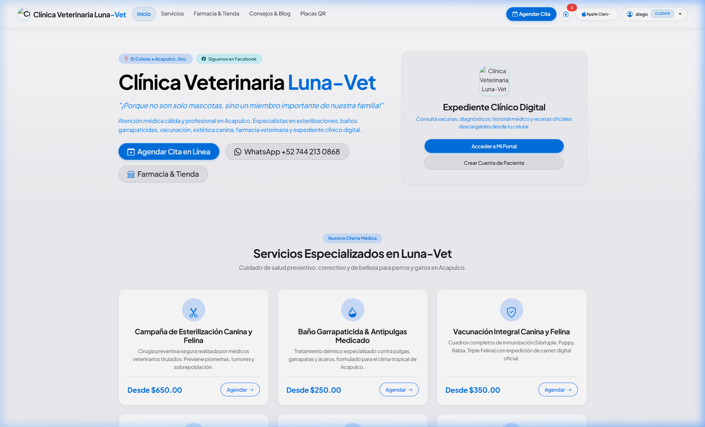
*Vista de la plataforma con el tema Apple Claro activo: máxima nitidez y luminosidad.*

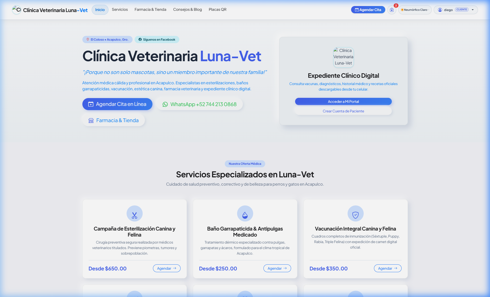
*Vista de la plataforma con el tema Neumórfico activo: relieves suaves y botones tridimensionales.*

> [!TIP]
> Tu selección de tema se guarda de manera automática en el dispositivo donde la elijas, por lo que no tendrás que configurarla cada vez que ingreses.

---

## 3. Módulo 1: Servicios Públicos (Sin Necesidad de Cuenta)

Cualquier persona puede ingresar a Luna-Vet desde su navegador web sin necesidad de registrarse previamente para informarse, solicitar citas o generar herramientas gratuitas para sus animales de compañía.

### 3.1 Página Principal y Catálogo Clínico

Al ingresar a la dirección de la clínica se despliega la portada principal de Luna-Vet:

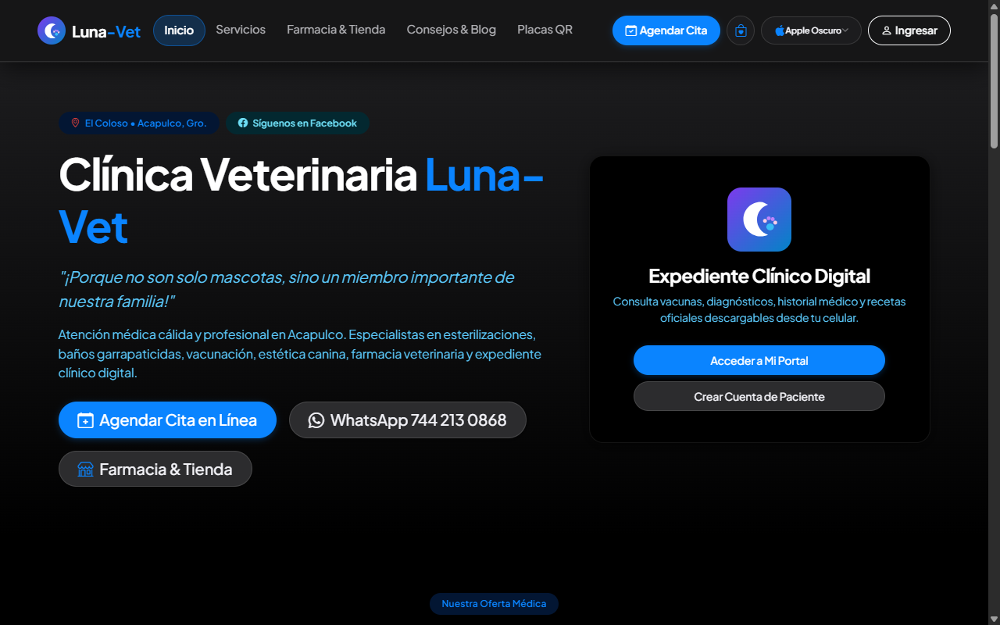
*Pantalla principal: accesos rápidos para agendar citas, farmacia, llamada directa de auxilio y portal de pacientes.*

En esta pantalla encontrarás:
- **Botón "Agendar Cita en Línea":** Te lleva directamente al calendario de citas.
- **Botón "WhatsApp 744 213 0868":** Abre una conversación inmediata con el equipo de guardia médica para casos urgentes.
- **Acceso Directo al Portal:** Para que ingreses a consultar las recetas y vacunas de tus mascotas.

Si haces clic en la opción **"Servicios"** de la barra superior, podrás consultar los detalles y recomendaciones de nuestra oferta médica:

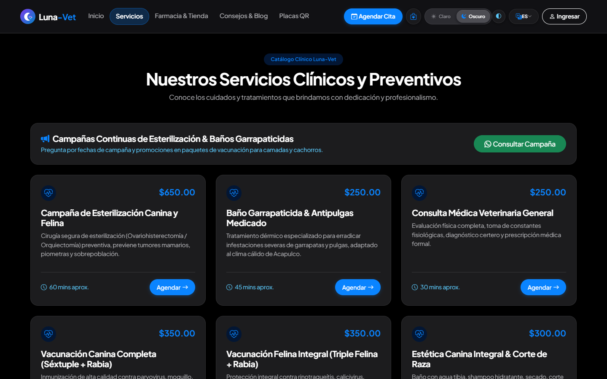
*Catálogo de servicios: cirugías de mínima invasión, esterilizaciones seguras, estética canina y laboratorio.*

---

### 3.2 Farmacia Veterinaria y Tienda de Alimentos

En la sección **"Farmacia & Tienda"** puedes revisar los medicamentos de libre venta, alimentos terapéuticos (Royal Canin, Pro Plan, Hill's), antipulgas y premios disponibles en la clínica.

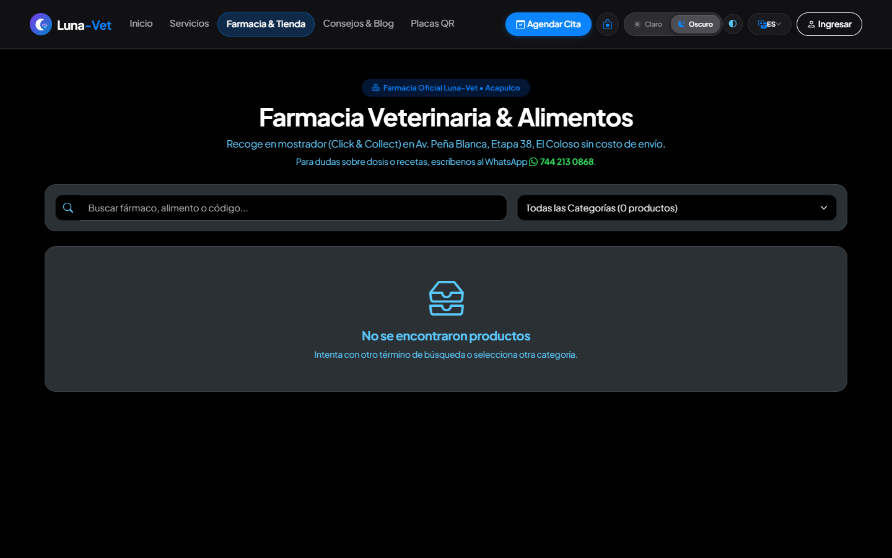
*Catálogo de farmacia con buscador por síntoma o nombre comercial y precios transparentes con IVA.*

#### ¿Cómo buscar un producto y agregarlo a tu bolsa?
1. Escribe el nombre del medicamento, alimento o accesorio en la barra de búsqueda superior (por ejemplo, *Simparica*, *Gastrointestinal* o *Shampoo*).
2. Filtra por categoría utilizando las pestañas superiores si buscas únicamente fármacos o alimentos.
3. Revisa la ficha del producto con su precio, presentación e indicaciones generales.
4. Haz clic en **"Agregar a la Bolsa"**. Podrás ver el resumen de tu compra en el icono de bolsa ubicado en la barra superior.

> [!NOTE]
> Los medicamentos controlados que requieren prescripción médica no se comercializan de forma libre en la tienda pública; únicamente pueden adquirirse presentando una receta médica válida expedida por un veterinario colegiado.

---

### 3.3 Agendamiento de Citas en Línea

Cualquier tutor puede apartar un espacio de atención médica o estética sin necesidad de llamar por teléfono.

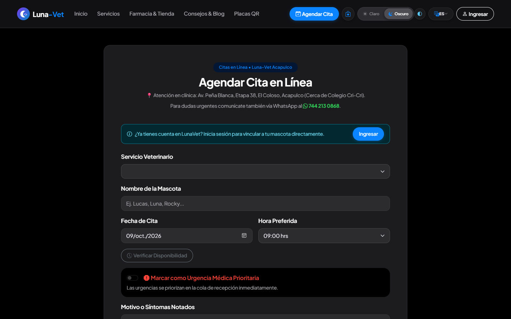
*Asistente paso a paso para agendar una cita médica o estética.*

#### Pasos para agendar tu cita:
1. Dirígete a la opción **"Agendar Cita"** en el menú superior o haz clic en el botón azul de la portada.
2. **Selecciona el tipo de servicio:**
   - Consulta General Preventiva
   - Vacunación o Desparasitación
   - Revisión Post-Quirúrgica o Curación
   - Estética Canina / Baño Medicado Garrapaticida
   - Triage / Revisión por Malestar
3. **Indica los datos de tu mascota:** Nombre, especie (perro o gato) y una breve descripción del motivo de tu visita (ejemplo: *"Tiene diarrea desde ayer"* o *"Le toca refuerzo de vacuna séxtuple"*).
4. **Elige la fecha y el horario disponible:** El sistema te mostrará únicamente los bloques de horario libres para evitarte tiempos de espera innecesarios en la sala de la clínica.
5. **Ingresa tus datos de contacto:** Tu nombre completo, número de WhatsApp para confirmar y correo electrónico.
6. Haz clic en **"Confirmar Cita"**. Recibirás un mensaje de confirmación con la fecha y hora agendada.

> [!TIP]
> Si tu mascota presenta una emergencia vital evidente (dificultad severa para respirar, convulsiones activas, atropellamiento o hemorragia profusa), no esperes una cita agendada; acude de inmediato a la clínica o presiona el botón de **WhatsApp de Urgencias 24/7**.

---

### 3.4 Generador Gratuito de Placas QR para Mascotas

En Luna-Vet ponemos a disposición de toda la comunidad de Acapulco una herramienta gratuita para crear placas de identificación inteligentes que facilitan el rescate de mascotas extraviadas.

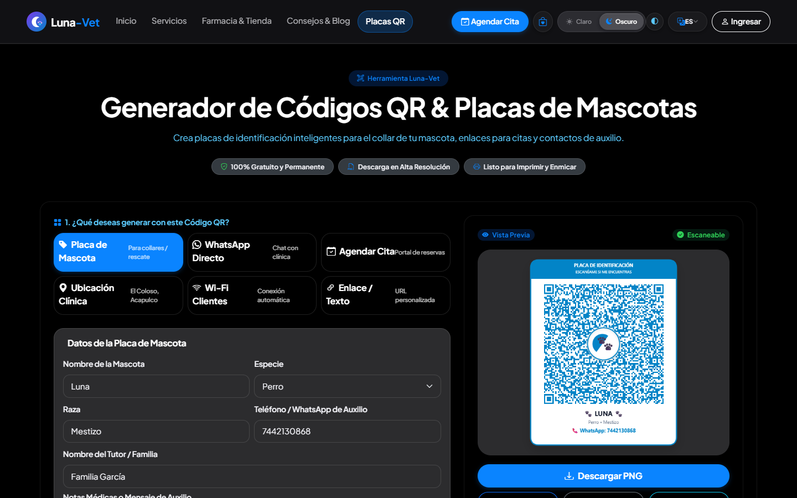
*Generador de placas QR: diseño personalizado con previsualización en vivo listo para imprimir.*

#### ¿Cómo diseñar la placa de tu mascota?
1. Ingresa a la sección **"Placas QR"** desde el menú principal.
2. Selecciona la opción **"Placa de Mascota"**.
3. Completa los campos del formulario:
   - **Nombre de tu mascota:** El nombre por el cual responde.
   - **Especie y Raza:** Perro mestizo, Poodle, Gato común, etc.
   - **Teléfono o WhatsApp de Auxilio:** El número celular al que llamará quien encuentre a tu compañero.
   - **Mensaje de Recompensa o Aviso Especial:** Por ejemplo, *"Tomo medicina diaria, por favor ayúdame a volver"* o *"Se ofrece gratificación"*.
4. Observa cómo en el recuadro derecho se genera en tiempo real el diseño con el código QR y los colores seleccionados.
5. Haz clic en **"Descargar en Alta Resolución (PNG/PDF)"**.
6. Imprime el diseño en papel fotográfico, recórtalo y enmícalo o llévalo a tu tienda de mascotas favorita para insertarlo en un porta-placas.

> [!NOTE]
> Cuando una persona escanee el código QR con la cámara de cualquier teléfono móvil, se abrirá de inmediato un botón para llamarte o enviarte un WhatsApp directo indicándote la ubicación aproximada donde fue encontrada tu mascota.

---

### 3.5 Verificador Público de Recetas Médicas

Para garantizar la seguridad de los tratamientos médicos y evitar la falsificación de recetas o prescripciones veterinarias en farmacias de la región, el sistema cuenta con un validador en tiempo real.

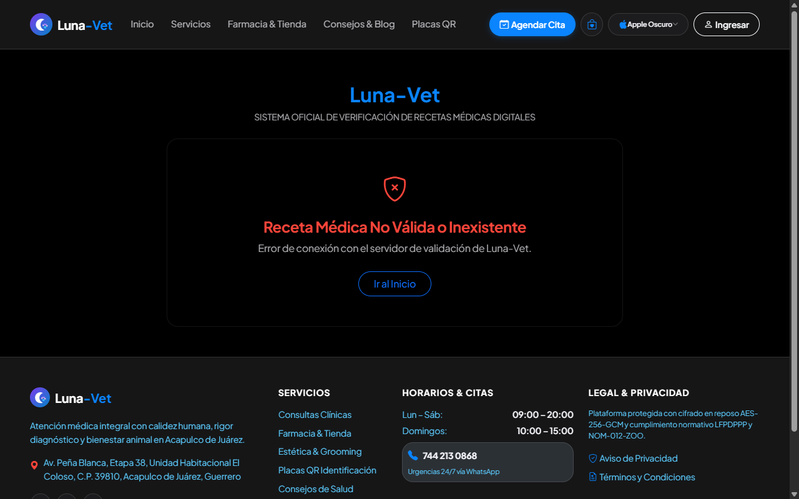
*Verificación de recetas: confirma la autenticidad, la cédula profesional del médico y la vigencia del tratamiento.*

#### ¿Cómo verificar una receta emitida por Luna-Vet?
1. En la parte inferior de cualquier receta física o digital emitida en la clínica encontrarás un folio único (por ejemplo: `REC-2026-0042`) y un código QR.
2. Escanea el código QR con tu celular o visita la dirección `lunavet.mx/receta/FOLIO`.
3. La pantalla te mostrará:
   - Nombre de la mascota y del tutor registrado.
   - Nombre del Médico Veterinario tratante y su **Cédula Profesional Oficial**.
   - Lista de medicamentos prescritos con dosis, horarios y días de tratamiento.
   - Indicador de autenticidad emitido directamente por el sistema central de la clínica.

---

## 4. Módulo 2: Registro, Inicio de Sesión y Seguridad

Para acceder a tu expediente digital, consultar recetas o realizar compras personalizadas, necesitas contar con una cuenta en la plataforma.

### 4.1 Cómo crear tu cuenta de tutor

Si es tu primera vez en Luna-Vet o acudes por primera vez a consulta:

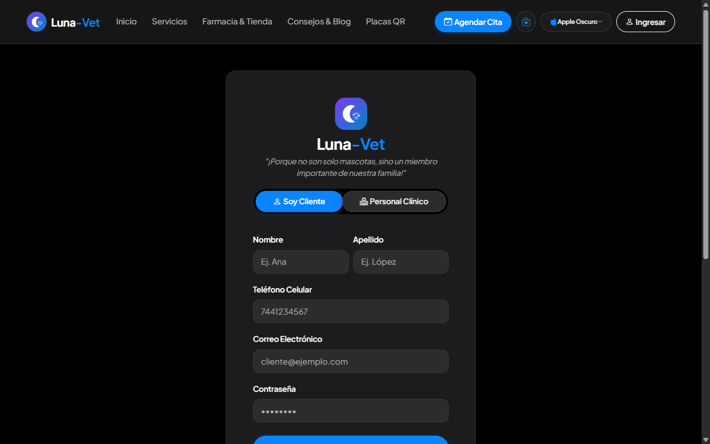
*Formulario de registro: seguro, rápido y centrado en la protección de tus datos.*

1. Haz clic en el botón **"Ingresar"** en la barra superior y selecciona la pestaña **"Crear Cuenta"** (o ingresa directo desde la portada).
2. Llena los siguientes campos:
   - **Nombre Completo:** Tu nombre y apellidos para reconocerte en recepción.
   - **Correo Electrónico:** Será tu usuario de acceso y donde recibirás notificaciones de salud de tus animales.
   - **Número de Teléfono / WhatsApp:** Indispensable para recordatorios de vacunas y avisos de estética.
   - **Contraseña:** Crea una contraseña segura de al menos 8 caracteres con números y letras.
3. Lee y marca la casilla de aceptación del **Aviso de Privacidad**.
4. Haz clic en el botón azul **"Registrarme"**. Tu sesión se iniciará de forma automática y serás dirigido a tu panel familiar.

---

### 4.2 Cómo iniciar sesión

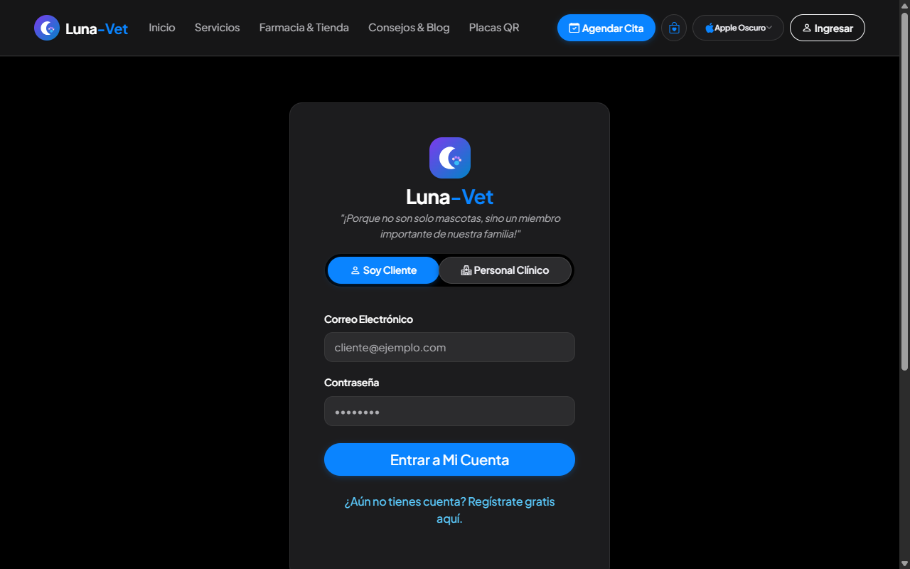
*Inicio de sesión con pestañas independientes para Tutores de Pacientes y Personal de la Clínica.*

1. Haz clic en **"Ingresar"** en la barra superior.
2. Asegúrate de estar en la pestaña adecuada:
   - **"Soy Tutor / Dueño de Mascota":** Si eres cliente de la clínica.
   - **"Personal de Clínica / Staff":** Si eres recepcionista, veterinario, estilista o administrador.
3. Introduce tu correo electrónico y tu contraseña.
4. Presiona el botón **"Iniciar Sesión"**.

> [!IMPORTANT]
> El personal de la clínica debe utilizar obligatoriamente la pestaña **"Personal de Clínica / Staff"**, ya que esta puerta de acceso activa los protocolos de seguridad necesarios para la emisión de recetas médicas y manejo de caja.

---

### 4.3 Protección de tu cuenta con verificación en dos pasos (2FA)

Para salvaguardar la privacidad de los historiales clínicos de tus mascotas y autorizaciones de pago, Luna-Vet permite activar la verificación de seguridad en dos pasos:

1. Al iniciar sesión en una cuenta protegida con doble factor, el sistema te solicitará un **Código de Seguridad Temporal de 6 dígitos**.
2. Abre la aplicación de autenticación de tu teléfono (Google Authenticator, Microsoft Authenticator o Apple Passwords).
3. Introduce los 6 dígitos antes de que expire el cronómetro en pantalla.
4. Presiona **"Confirmar Código"** para acceder a tu panel.

---

### 4.4 Recuperación de contraseña y cierre de sesión seguro

- **¿Olvidaste tu contraseña?** En la pantalla de inicio de sesión haz clic en el enlace *"¿Olvidaste tu contraseña?"*, introduce tu correo registrado y recibirás un enlace seguro para definir una nueva clave.
- **Cierre de sesión seguro:** Si utilizas una computadora compartida en un café internet, biblioteca o mostrador público, haz clic sobre tu nombre en la esquina superior derecha y selecciona **"Cerrar Sesión"**. Esto garantiza que nadie más pueda ver las recetas ni los datos de tus mascotas.

---

## 5. Módulo 3: Portal del Tutor (Expediente Digital de tu Mascota)

El Portal del Tutor es tu espacio personal donde conservas de por vida toda la información de salud de tus perros, gatos y otras especies atendidas en Luna-Vet.

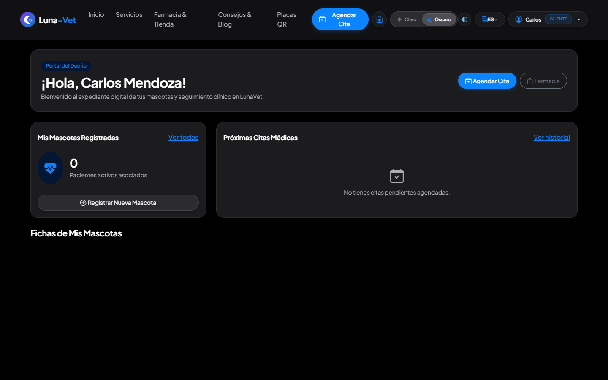
*Panel de bienvenida del tutor: contador de mascotas activas, citas agendadas y accesos directos.*

### 5.1 Tu panel de inicio

Al entrar al portal observarás tres tarjetas informativas:
1. **Mis Mascotas Registradas:** Muestra la cantidad de animales dados de alta bajo tu tutela y un botón para dar de alta a un nuevo integrante.
2. **Próximas Citas Médicas:** Un listado con las citas que tienes programadas para los próximos días con fecha, hora y motivo.
3. **Fichas de Mascotas:** Tarjetas individuales con la fotografía, nombre, edad y estatus de salud de cada uno de tus compañeros de cuatro patas.

---

### 5.2 Cómo registrar y actualizar los datos de tu mascota

Para que el equipo médico tenga la información completa antes de tu visita:

1. En tu panel del portal, haz clic en el botón **"Registrar Nueva Mascota"**.
2. Completa los datos en la ventana que se desplegará:
   - **Nombre de la mascota:** (Ejemplo: *Luna*, *Max*, *Pelusa*).
   - **Especie:** Perro, Gato, Ave, Roedor u Otro.
   - **Raza y Color:** (Ejemplo: *Labrador Retriever dorado* o *Mestizo atigrado*).
   - **Fecha de Nacimiento o Edad Aproximada:** Fundamental para el cálculo de dosis de vacunas y desparasitantes.
   - **Sexo y Estado Reproductivo:** Macho / Hembra y si se encuentra castrado o esterilizado.
   - **Número de Microchip:** (Opcional, si tu mascota cuenta con chip de rastreo).
   - **Foto:** Sube una imagen clara del rostro de tu mascota para que el equipo la identifique en recepción.
3. Haz clic en **"Guardar Mascota"**. La ficha quedará vinculada de inmediato a tu expediente.

---

### 5.3 Consulta de carnet de vacunación y expediente médico

Olvídate de las cartillas de vacunación en papel que se maltratan o extravían. En Luna-Vet tu carnet es 100% digital y siempre está en tu bolsillo.

1. Dentro de tu panel, haz clic sobre la tarjeta de tu mascota o en el enlace **"Ver Expediente"**.
2. En la pantalla del expediente podrás revisar cuatro pestañas principales:
   - **Carnet de Vacunación:** Lista de vacunas aplicadas con la marca, lote, fecha de aplicación y la fecha sugerida para su próximo refuerzo.
   - **Historial de Consultas:** Resumen de cada visita a la clínica, diagnóstico médico emitido y peso registrado en cada fecha.
   - **Recetas y Tratamientos:** Copia fiel de las recetas prescritas por el veterinario, con la indicación exacta de medicamentos y la posibilidad de descargar el archivo PDF con un solo clic.
   - **Estudios y Archivos:** Fotografías de radiografías, resultados de análisis de sangre y coprológicos realizados en laboratorio.

> [!TIP]
> Si sales de viaje o requieres presentar la cartilla de vacunación en una pensión canina o aeropuerto, descarga el PDF oficial de vacunas presionando el botón **"Descargar Carnet Oficial"**.

---

### 5.4 Administración y seguimiento de tus citas

- **Revisar citas:** En la pestaña **"Mis Citas"** verás tus consultas confirmadas, pendientes o concluidas.
- **Reprogramar una cita:** Si surge un imprevisto, puedes solicitar una nueva fecha u horario con al menos 2 horas de anticipación presionando el botón **"Cambiar Horario"**.
- **Cancelar:** Si no podrás acudir, presiona **"Cancelar Cita"** para liberar el espacio y permitir que otra mascota que lo necesite pueda ser atendida por el médico.

---

### 5.5 Compras con retiro directo en clínica (Click & Collect)

Para evitarte filas en mostrador al comprar alimento o reponer medicamentos:
1. Agrega los artículos deseados a tu bolsa desde la sección **"Farmacia & Tienda"**.
2. Haz clic en el icono de la bolsa de compras y presiona **"Continuar al Pago"**.
3. Selecciona la modalidad **"Recoger en Clínica (Acapulco El Coloso)"**.
4. Elige si prefieres pagar en línea o al momento de recoger en mostrador con tarjeta o efectivo.
5. Haz clic en **"Confirmar Pedido"**. Recibirás una notificación cuando tu paquete esté empaquetado y listo en mostrador.

---

## 6. Módulo 4: Portal Clínico (Veterinarios, Estilistas y Recepción)

Este módulo está destinado exclusivamente al equipo operativo de Luna-Vet Acapulco. Cuenta con herramientas médicas especializadas para agilizar la atención y garantizar el cumplimiento de las normativas de salud veterinaria mexicanas.

### 6.1 Agenda Diaria y Control de Turnos

La agenda clínica es el corazón de la operación diaria. Permite organizar las consultas, cirugías, baños y revisiones sin que se empalmen los horarios.

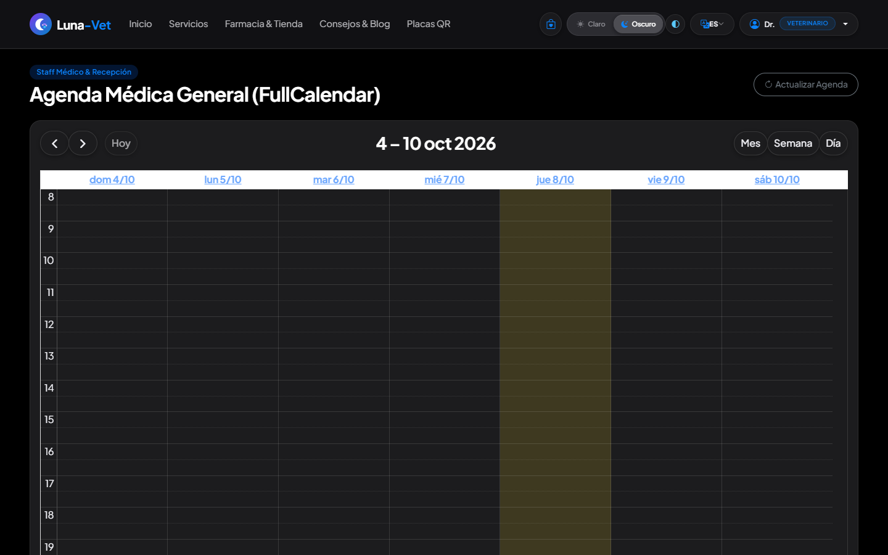
*Agenda médica: vista semanal interactiva con código de colores por tipo de servicio y doctor asignado.*

#### Funcionalidades clave de la agenda:
- **Vista por Horario (Día / Semana / Mes):** Selecciona en la parte superior el formato que mejor se acomode a tu flujo de trabajo.
- **Colores por Servicio:** Las citas se identifican al instante:
  - 🔵 **Azul:** Consulta Médica General
  - 🔴 **Rojo:** Cirugía o Quirófano
  - 🟢 **Verde:** Vacunación y Medicina Preventiva
  - 🟡 **Amarillo:** Estética y Baño
- **Cambio de Horario Ágil:** Puedes arrastrar un bloque de cita a otra hora para reagendar rápidamente ante la llegada imprevista de un paciente en triage.
- **Recepción en Mostrador:** Al llegar el tutor a la clínica, el recepcionista hace clic en la cita y marca el botón **"Paciente en Sala de Espera"**. El médico verá el cambio de estado en su pantalla de inmediato.

---

### 6.2 Consulta Médica y Emisión de Recetas Digitales

Cuando el médico veterinario recibe al paciente en el consultorio, abre la pantalla de consulta:

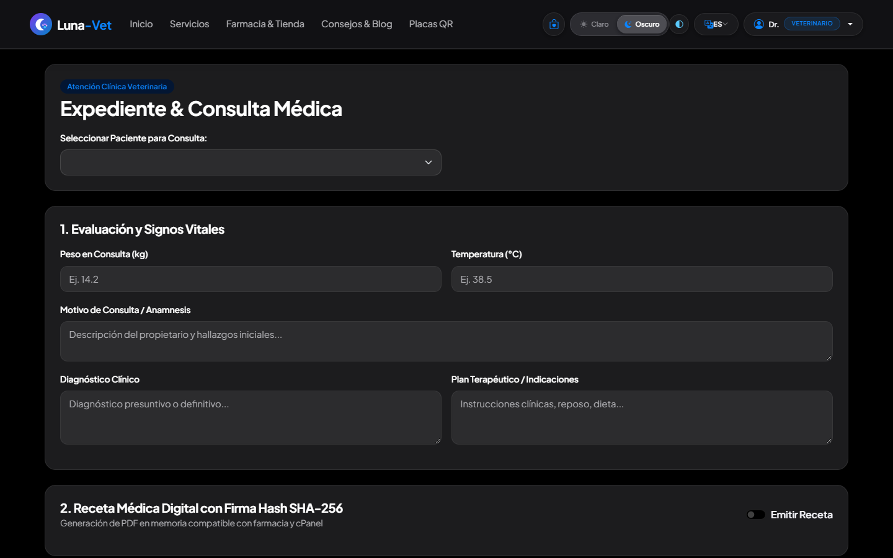
*Pantalla de consulta médica: anamnesis, constantes fisiológicas, diagnóstico y prescripción.*

#### Procedimiento durante la consulta:
1. **Registro de Constantes Fisiológicas:**
   - Peso actual en kilogramos (crucial para el cálculo automático de dosis).
   - Temperatura corporal en grados Celsius (rango normal canino: 37.5°C a 39.2°C).
   - Frecuencia cardíaca (lpm) y frecuencia respiratoria (rpm).
   - Tiempo de llenado capilar (TLLC) y condición corporal (escala del 1 al 5).
2. **Anamnesis y Exploración Física:** Registro de los síntomas referidos por el tutor y hallazgos en la auscultación o palpación.
3. **Diagnóstico Presuntivo y Definitivo:** Selección del cuadro clínico principal.
4. **Prescripción de Medicamentos:**
   - Selecciona el fármaco del catálogo clínico de la clínica.
   - El sistema sugiere la posología estándar según el peso registrado de la mascota.
   - Especifica la vía de administración (oral, subcutánea, tópica), la frecuencia (cada 8, 12 o 24 horas) y la duración total en días.
5. **Firma y Emisión:** El médico presiona **"Guardar y Emitir Receta"**. El sistema genera de forma automática el folio único con código QR y la cédula profesional del médico firmante. La receta queda guardada en el portal del tutor y lista para imprimirse en recepción.

> [!IMPORTANT]
> Toda receta emitida queda blindada contra modificaciones posteriores para garantizar su validez legal y proteger tanto al paciente como al médico veterinario tratante.

---

### 6.3 Libro de Control Oficial de Medicamentos (SENASICA)

En estricto cumplimiento con la legislación veterinaria mexicana y las directrices de SENASICA y SAGARPA para el manejo de psicotrópicos, anestésicos y antibióticos restringidos:

#### ¿Cómo registrar un movimiento de medicamento controlado?
1. Ingresa a la sección **"Staff" > "Medicamentos Controlados"**.
2. **Para registrar una Entrada (Reabastecimiento):**
   - Presiona **"Registrar Entrada de Lote"**.
   - Captura el nombre del fármaco (ej. *Ketamina*, *Tramadol*, *Diazepam*).
   - Introduce el laboratorio fabricante, número de lote, fecha de caducidad y número de factura del distribuidor autorizado.
3. **Para registrar una Salida (Uso Clínico o Quirúrgico):**
   - Selecciona **"Registrar Uso en Paciente"**.
   - Vincula el paciente mediante su número de expediente o cita.
   - Indica la dosis exacta administrada en mililitros o miligramos.
   - Selecciona el nombre del Médico Veterinario responsable e introduce su cédula profesional.
4. Haz clic en **"Asentar en Libro Oficial"**.

> [!CAUTION]
> Los asientos en el libro de medicamentos controlados son definitivos y auditables por inspectores sanitarios. Nunca registres salidas sin antes corroborar la dosis exacta cargada en jeringa.

---

### 6.4 Hospitalización, Triage y Cuidados Intensivos (UCI)

Para los pacientes que requieren estancia en observación, sueroterapia continua o recuperación post-anestésica:

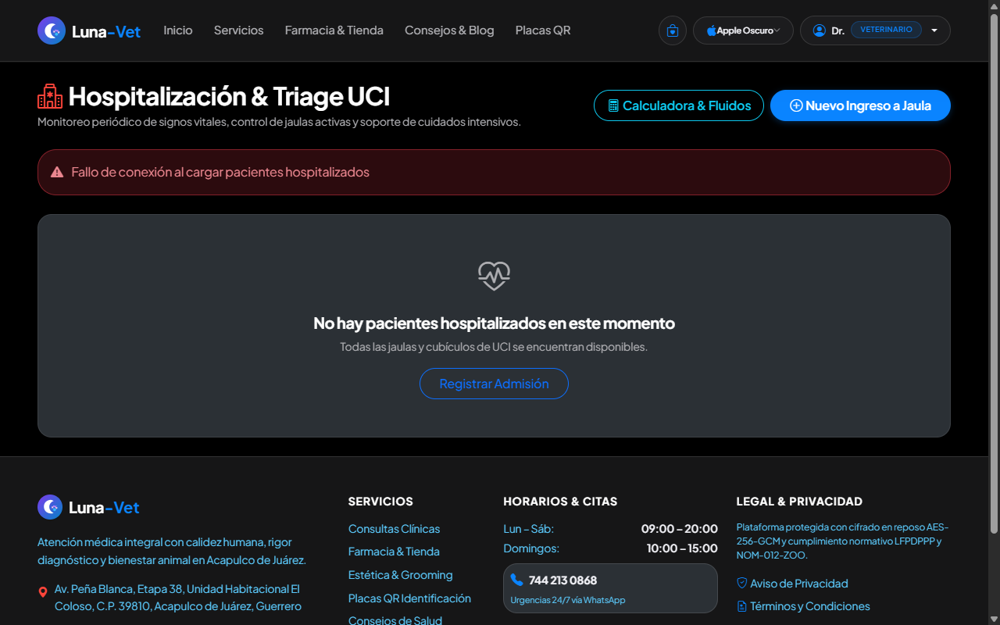
*Monitor de hospitalización: control de jaulas activas, calculadora de fluidos y signos vitales horarios.*

#### Operación del módulo de hospitalización:
1. **Admisión a Jaula:**
   - Presiona el botón azul **"Nuevo Ingreso a Jaula"**.
   - Selecciona al paciente y asígnale un cubículo (ej. *Jaula Canina 02 - Aislamiento* o *Cubículo Felino 01*).
   - Registra el diagnóstico de ingreso y el plan de tratamiento prescrito.
2. **Calculadora de Fluidoterapia:**
   - Presiona el botón **"Calculadora & Fluidos"**.
   - Introduce el peso del paciente, el porcentaje de deshidratación estimado (ej. 5%, 8%) y las pérdidas continuas.
   - El sistema calculará automáticamente la tasa de infusión en mililitros por hora (mL/h) y gotas por minuto con macrogotero o microgotero.
3. **Registro Horario de Signos y Escala de Dolor:**
   - El personal de enfermería captura cada 2, 4 o 6 horas la temperatura, glucosa, micción y actitud.
   - Aplica la **Escala de Dolor de Glasgow** integrada para determinar si el paciente requiere analgesia de rescate.
4. **Alta Médica:**
   - Cuando el paciente se encuentre estable y listo para regresar a casa, presiona **"Dar de Alta"**.
   - Redacta las indicaciones de cuidados en el hogar y recetas de continuación. El estatus de la jaula pasará automáticamente a *"Disponible para desinfección"*.

---

### 6.5 Estética Canina y Felina (Admisión y Hoja de Manto)

Para evitar inconformidades con los tutores respecto al estado físico previo de sus mascotas:

1. Al recibir al perro o gato para baño o corte, ingresa a **"Staff" > "Estética & Grooming"**.
2. **Hoja de Admisión Digital:**
   - Marca en el esquema interactivo de la mascota si presenta nudos severos, presencia de pulgas/garrapatas, cicatrices previas, verrugas o dolor al tacto en oídos.
   - Anota el tipo de corte solicitado por el cliente (ej. *Corte de raza Schnauzer*, *Corte higiénico*, *Deslanado*).
   - Solicita la confirmación verbal del tutor.
3. **Finalización del Servicio:**
   - Al terminar el secado y cepillado, presiona **"Servicio Concluido"**.
   - El sistema envía automáticamente una notificación de WhatsApp al tutor indicándole: *"¡Tu mascota está lista, perfumada y esperándote en Luna-Vet!"*.

---

### 6.6 Recordatorios Preventivos y Notificaciones

Para garantizar que los cachorros y adultos no pierdan su esquema de salud:
- El módulo de **Recordatorios** analiza las fechas de vencimiento de vacunas séxtuples, rabia, giardia, bordetella y desparasitación interna.
- Con un solo clic en **"Generar Avisos del Mes"**, el sistema genera los mensajes personalizados de recordatorio para que recepción los envíe por WhatsApp o correo a los tutores.

---

### 6.7 Punto de Venta Mostrador (POS) y Arqueo de Caja Chica

El Punto de Venta unificado permite cobrar con rapidez medicamentos, alimentos, consultas médicas y servicios de estética en una sola cuenta.

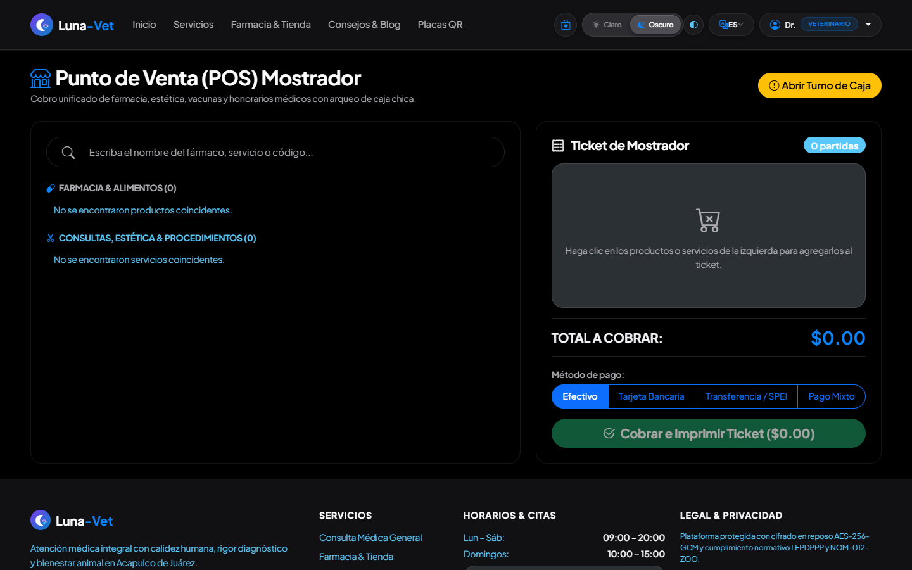
*Punto de venta mostrador: cobro integrado con selector de métodos de pago y ticket en vivo.*

#### A. Apertura de Turno de Caja (Al Iniciar el Día)
1. Al llegar a mostrador, presiona el botón amarillo **"Abrir Turno de Caja"**.
2. En la ventana emergente, ingresa el **Fondo Inicial en Efectivo** (el cambio que tienes en el cajón de dinero, por ejemplo: `$500.00 MXN`).
3. Haz clic en **"Confirmar Apertura"**. El punto de venta quedará habilitado para cobrar.

#### B. Cobro de Productos y Servicios
1. Escribe en la barra de búsqueda el nombre del fármaco, alimento o servicio (o búscalo en el listado por categoría).
2. Haz clic sobre el artículo para sumarlo al ticket de la derecha. Puedes aumentar la cantidad con los botones `+` o `-`.
3. Selecciona el **Método de Pago**:
   - 💵 **Efectivo:** Ingresa con cuánto dinero paga el cliente; la pantalla calculará el cambio exacto a entregar.
   - 💳 **Tarjeta Bancaria:** Para cobro en terminal bancaria de débito o crédito.
   - 📲 **Transferencia / SPEI:** Registra el cobro por banca móvil.
   - 🔄 **Mixto:** Si el cliente paga una parte en efectivo y el resto con tarjeta.
4. Presiona el botón verde **"Cobrar e Imprimir Ticket"**.
5. Se generará el ticket de compra con desglose de IVA y folio de control.

#### C. Arqueo y Corte Z (Al Terminar el Turno)
1. Al concluir tu jornada de trabajo en recepción, presiona **"Arqueo y Corte Z"**.
2. Cuenta el dinero en efectivo que tienes físicamente en el cajón y escribe el monto en la pantalla.
3. El sistema comparará tu conteo físico contra las ventas registradas por el sistema y te mostrará:
   - Total de ventas en efectivo.
   - Total de ventas en tarjeta y transferencias.
   - Diferencia (si hay sobrante o faltante).
4. Presiona **"Cerrar Turno de Caja"** para imprimir el comprobante oficial de corte.

> [!CAUTION]
> Una vez cerrado el turno de caja, no se podrán agregar más ventas a ese folio de arqueo. Cualquier venta posterior requerirá la apertura de un nuevo turno.

---

## 7. Módulo 5: Panel de Dirección y Administración General

Diseñado para los socios, directores médicos y administradores de Luna-Vet Acapulco. Permite tener el control integral del negocio, supervisar la rentabilidad y asegurar la excelencia médica.

### 7.1 Tablero de Indicadores Clave (KPIs en Tiempo Real)

Al ingresar a la sección de administración se despliega el centro de mando:

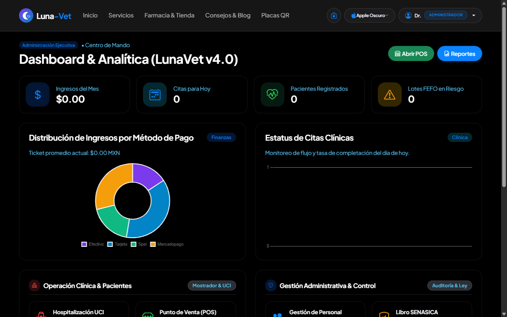
*Panel de administración: ingresos del mes, citas completadas, pacientes activos y gráfica de métodos de pago.*

#### Métricas principales:
- **Ingresos del Mes:** Total acumulado en pesos mexicanos facturados en el periodo actual.
- **Citas para Hoy:** Cantidad de consultas programadas en el día y porcentaje de asistencia.
- **Pacientes Registrados:** Base de datos activa de animales bajo seguimiento clínico.
- **Lotes FEFO en Riesgo:** Alerta preventiva sobre medicamentos o vacunas que caducan en menos de 30 o 60 días.
- **Gráfica de Métodos de Pago:** Distribución porcentual entre efectivo, tarjetas bancarias y transferencias para conciliación contable.

---

### 7.2 Administración de Personal Clínico y Cédulas Médicas

1. Ingresa a **"Administración" > "Personal (Staff)"**.
2. **Dar de alta a un colaborador:**
   - Presiona **"Nuevo Colaborador"**.
   - Captura su nombre completo, correo institucional y teléfono.
   - Asigna su rol en el sistema: *Veterinario*, *Recepcionista*, *Estilista* o *Administrador*.
   - Si es médico veterinario, captura su **Cédula Profesional Oficial** y especialidad (ej. *Cirugía de Tejidos Blandos*, *Dermatología*).
3. **Activar o desactivar accesos:** Si un miembro del personal concluye su ciclo laboral, puedes suspender su acceso de inmediato con un solo clic sin perder el registro histórico de las consultas que atendió.

---

### 7.3 Control Inteligente de Inventario y Caducidades FEFO

Para garantizar que en la clínica nunca se aplique un producto vencido y evitar pérdidas económicas por caducidad:

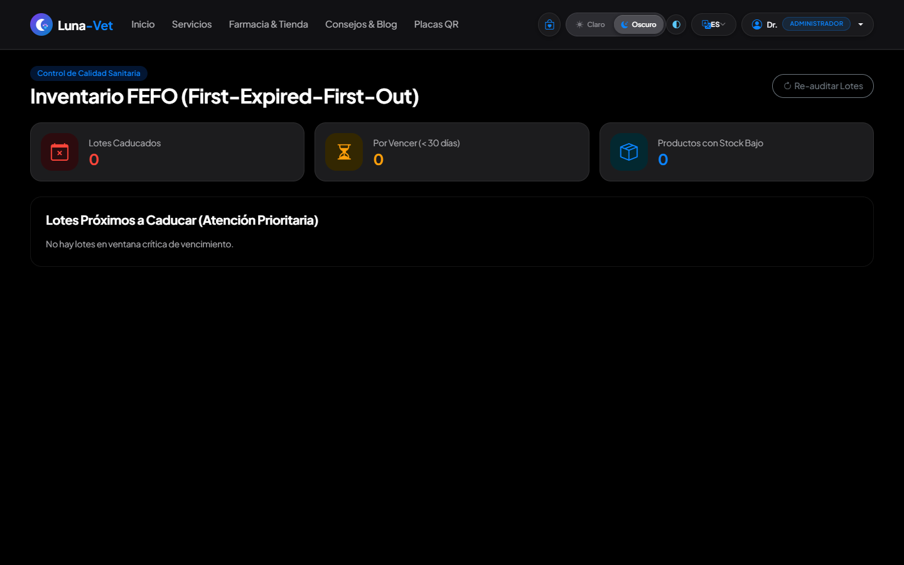
*Gestión de inventario FEFO: semáforo de caducidades, alertas de stock mínimo y control de lotes.*

#### ¿Qué es el método FEFO?
FEFO son las siglas en inglés de *First Expired, First Out* (Primero en Vencer, Primero en Salir). El sistema prioriza en el punto de venta y en quirófano aquellos lotes de vacunas y medicamentos cuya fecha de caducidad esté más próxima.

#### Operación del módulo de inventario:
- **Semáforo de Vencimiento:**
  - 🟢 **Verde:** Lote con caducidad lejana (más de 90 días).
  - 🟡 **Amarillo:** Lote con caducidad próxima (entre 30 y 90 días). Se recomienda ofrecerlo en promociones o utilizarlo prioritariamente.
  - 🔴 **Rojo:** Lote crítico (menos de 30 días o vencido). El sistema bloquea automáticamente su venta en el mostrador para proteger al paciente.
- **Ajuste de Existencias:** Puedes registrar entradas por compra a proveedores, mermas por frasco roto o consumo interno en hospitalización.

---

### 7.4 Reportes Financieros y Cortes Globales

1. Dirígete a **"Administración" > "Reportes Financieros"**.
2. Selecciona el rango de fechas que deseas consultar (hoy, esta semana, este mes o personalizado).
3. Consulta los desgloses:
   - Ventas por línea de negocio (Servicios Médicos vs. Farmacia vs. Estética).
   - Rendimiento por médico veterinario (consultas atendidas y procedimientos realizados).
   - Descarga el reporte consolidado en formato Excel o PDF para tu contador.

---

### 7.5 Bitácora de Auditoría y Protección de Datos

En cumplimiento de la Ley Federal de Protección de Datos Personales en Posesión de los Particulares (LFPDPPP) y normativas de auditoría interna:
- El módulo de **Auditoría** registra de forma inmutable quién realizó cada acción sensible:
  - Cambios en el expediente de un paciente.
  - Anulación de tickets o ventas en el punto de venta.
  - Creación o edición de usuarios del sistema.
  - Descargas de información confidencial.

---

### 7.6 Gestor de Contenido del Sitio Web y Campañas

1. Ingresa a **"Administración" > "Contenidos (CMS)"**.
2. Modifica directamente los teléfonos de guardia, horarios de atención para días festivos o banners con campañas de vacunación antirrábica y esterilización masiva en Acapulco sin necesidad de conocimientos de programación.

---

## 8. Preguntas Frecuentes y Guía de Ayuda Rápida

### Para Tutores de Mascotas

**¿Tiene algún costo descargar las recetas médicas o la placa QR?**  
No. Todas las herramientas del portal, la descarga de tus recetas en PDF y el generador de placas de identificación son 100% gratuitos para los clientes de Luna-Vet.

**¿Qué hago si no recuerdo la contraseña de mi cuenta?**  
En la pantalla de ingreso haz clic en *"¿Olvidaste tu contraseña?"*, introduce tu correo y recibirás un enlace seguro para crear una nueva clave.

**¿Puedo registrar más de una mascota con mi misma cuenta?**  
Sí, puedes registrar a todos los animales que tengas en casa bajo el mismo perfil. En tu portal verás la ficha individual de cada uno con su historial por separado.

**¿Cómo demuestro en una aerolínea o pensión que las vacunas de mi perro son válidas?**  
Ingresa a tu portal, abre el expediente de tu mascota y presiona **"Descargar Carnet Oficial"**. El documento emitido cuenta con la firma del médico, su cédula profesional y el código QR de verificación de autenticidad que cualquier autoridad puede escanear.

---

### Para Recepción y Personal Clínico

**¿Qué ocurre si el sistema no encuentra un producto al momento de cobrar en el POS?**  
Verifica que estés escribiendo el nombre sin faltas de ortografía o utiliza el código interno. Si es un producto nuevo que acaba de llegar del proveedor, solicítale al administrador que lo dé de alta en el inventario antes de agregarlo al ticket.

**¿Puedo cobrar un ticket combinando efectivo y tarjeta bancaria?**  
Sí. En la pantalla del punto de venta selecciona el método **"Mixto"**. Escribe primero el importe en efectivo que entrega el cliente y el sistema asignará el saldo restante a la terminal bancaria.

**¿Qué debo hacer si accidentalmente ingresé mal el fondo de caja al abrir el turno?**  
No intentes compensarlo cobrando tickets ficticios. Notifica de inmediato al administrador para que registre una nota de ajuste en la bitácora de caja antes de realizar el corte final del turno.

**¿Por qué el sistema no me deja prescribir un antibiótico o sedante?**  
Para prescribir medicamentos controlados es obligatorio que el médico que haya iniciado sesión tenga registrada su **Cédula Profesional Oficial** en su perfil de colaborador.

---

## 9. Directorio de Contacto y Asistencia

Si experimentas alguna dificultad con la plataforma o requieres atención médica de emergencia para tu mascota, comunícate con nosotros:

- 🏥 **Dirección de la Clínica:** Av. Peña Blanca, Etapa 38, Unidad Habitacional El Coloso, C.P. 39810, Acapulco de Juárez, Guerrero.
- 📞 **Teléfono de Consultorio:** (744) 213 0868
- 🟢 **WhatsApp de Urgencias y Citas:** +52 744 213 0868
- 🌐 **Portal en Línea:** `https://lunavet.mx`
- 🕒 **Horario de Consulta Regular:**
  - Lunes a Sábado: 09:00 a 20:00 hrs.
  - Domingos: 10:00 a 15:00 hrs.
  - Guardias y Urgencias: Atención 24 horas mediante previa llamada telefónica o WhatsApp.
